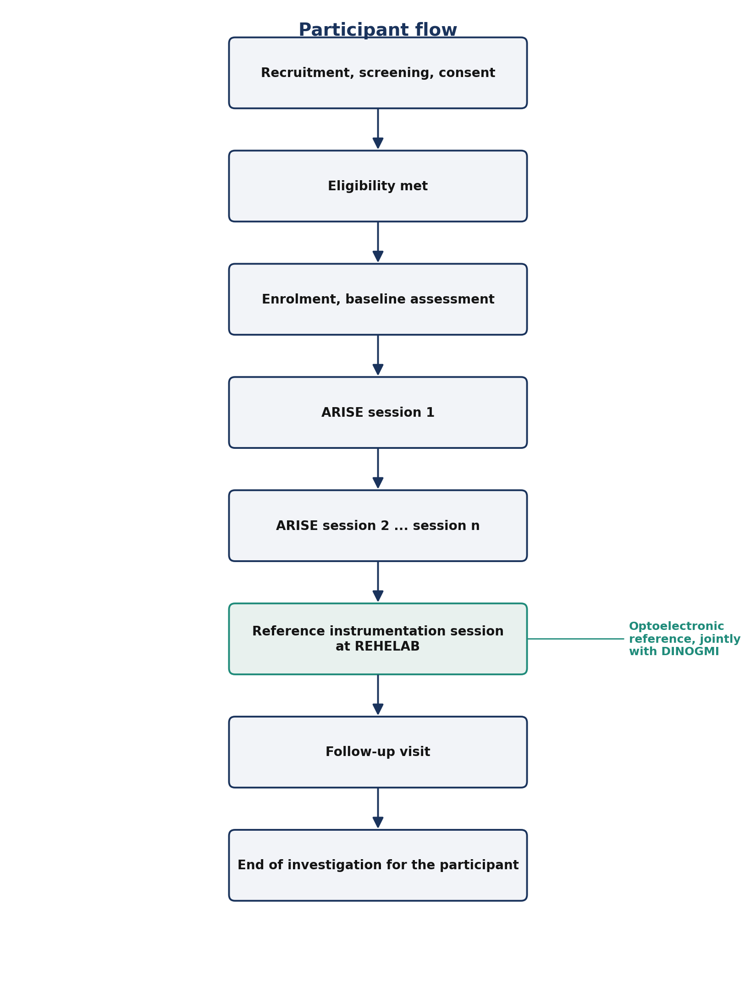

# Clinical Investigation Plan

| Field | Value |
|---|---|
| Document title | Clinical Investigation Plan for the ARISE system, Phase 1 demonstration |
| Document identifier | ARISE-CIP-001 |
| Version | [TO BE COMPLETED at submission] |
| Date | [TO BE COMPLETED at submission] |
| Investigational device | ARISE (Augmented Rehabilitation and Intelligent System for Enhancement) |
| Manufacturer and sponsor | Innovina S.r.l. |
| Scientific partner | DINOGMI, University of Genoa |
| Clinical site | Studio Buccarella |
| Reference instrumentation site | REHELAB, University of Genoa |
| Confirmed MDR classification | Class IIa under Annex VIII Rule 11 |
| Status | Draft for internal review |

## 1. Background

### 1.1 Clinical context

The Sit-to-Stand transfer is a basic functional movement performed many times a day in routine life and dozens of times per session in motor rehabilitation. The ability to perform it well is a clinically meaningful marker of lower-limb strength, balance, and functional independence, and a degraded performance is associated with elevated fall risk.

Standard assessment in the clinic is observational and time-based. It does not capture the angular trajectories of the trunk, hip, and knee, the velocity profile, the symmetry between sides, or specific compensations such as excessive trunk flexion, asymmetric loading, or knee valgus. Quantitative kinematic assessment exists in laboratory motion-capture studios but is not compatible with daily use in a rehabilitation gym.

### 1.2 The ARISE system

ARISE is a markerless single-camera system that runs at the edge in the clinical environment. It provides three things:

- Real-time three-dimensional kinematic measurement of the Sit-to-Stand transfer (trunk, hip, knee angles and velocities)
- Detection of pre-defined kinematic errors using a 14-code clinical error taxonomy defined in Deliverable D1.1
- Audiovisual biofeedback to the patient during the transfer, designed for low cognitive load

A clinical dashboard summarises sessions for the therapist.

## 2. Investigational device

### 2.1 Device identification

| Field | Value |
|---|---|
| Trade name | ARISE |
| Generic name | Markerless computer-vision system for biomechanical assessment of the Sit-to-Stand transfer |
| Hardware components | Coach edge device, single RGB camera, optional infrared depth module |
| Software components | On-device processing engine, clinical dashboard, cloud back-end |
| Software version under investigation | [TO BE COMPLETED at submission] |
| Hardware version under investigation | [TO BE COMPLETED at submission] |
| Manufacturer | Innovina S.r.l. |
| Patient contact | None, the device is contactless |
| Energy delivered to the patient | None |

### 2.2 Intended purpose

ARISE is intended for use by qualified rehabilitation professionals to support the objective assessment of the Sit-to-Stand transfer in adults undergoing motor rehabilitation. The device provides quantitative kinematic measurements and real-time audiovisual biofeedback during the transfer. The device does not replace clinical judgment. Decisions on diagnosis, on the rehabilitation plan, and on treatment progression remain with the qualified clinician.

### 2.3 Indications and contraindications

**Indications**: adults undergoing rehabilitation that includes the Sit-to-Stand transfer; healthy adult volunteers participating in the reference dataset.

**Contraindications**: medical contraindication to repeated Sit-to-Stand transfers; inability to provide informed consent and no authorised legal representative; recent injury or surgery of the lower limbs or trunk preventing safe participation; cognitive impairment severe enough to prevent comprehension of the investigation; concurrent participation in another interventional clinical investigation.

### 2.4 MDR classification

The ARISE device is classified as **Class IIa** under MDR Annex VIII, **Rule 11**, as software intended to provide information used for therapeutic decisions, where the consequences of those decisions do not cause death, irreversible deterioration, serious deterioration, or surgical intervention. The detailed rationale is given in the **ARISE MDR Compliance Plan**, Section 4.

### 2.5 Principle of operation

The system acquires video frames of the patient from a single calibrated camera positioned in front of the seat used for the Sit-to-Stand transfer. The on-device engine estimates the three-dimensional skeleton at each frame, computes the angular and velocity trajectories of the trunk, hip, and knee, and segments the transfer into its six characteristic phases (sitting, forward lean, lift-off, standing, stabilisation, descent). A detection layer combining a population rule, a per-patient z-score, and a deep learning model identifies the kinematic errors defined in the D1.1 taxonomy. Biofeedback is presented to the patient on a display and a loudspeaker. The clinical dashboard summarises the session and stores per-session metrics for longitudinal review. A complete description is given in the companion **ARISE Investigator's Brochure**.

## 3. Objectives, endpoints, and hypotheses

### 3.1 Primary objective

To assess the agreement between the kinematic measurements produced by ARISE and the corresponding measurements produced by the laboratory reference at REHELAB, for the Key Performance Indicators defined in Deliverable D1.1.

### 3.2 Primary endpoint and acceptance threshold

The primary endpoint is the agreement, expressed by an appropriate accuracy metric (for example, Mean Absolute Error), between an ARISE-derived KPI and the simultaneous reference measurement obtained at REHELAB.

The exact KPI used as the primary endpoint, the exact agreement metric, and the acceptance threshold are **agreed jointly between Innovina, DINOGMI, and the biostatistician** and are recorded in the **ARISE Validation Acceptance Criteria** companion document. They are finalised before the first reference instrumentation session.

This positioning is deliberate: the precise threshold cannot be honestly set in this Plan until DINOGMI has confirmed the variance assumptions in the published literature against pilot data from REHELAB.

### 3.3 Secondary objectives and endpoints

| Code | Secondary objective | Endpoint |
|---|---|---|
| SO-1 | Accuracy of the remaining KPIs | Agreement metric of each remaining KPI against the reference |
| SO-2 | Detection performance of the error taxonomy | Sensitivity, specificity, and F1 score per error code, against expert clinical labels |
| SO-3 | Usability for therapists | System Usability Scale completed by therapists |
| SO-4 | Acceptability of the biofeedback | Structured questionnaire on clarity, usefulness, and absence of distress |
| SO-5 | Practical integration in the clinical workflow | Set-up time per session, total session duration, number of interruptions |
| SO-6 | Device-related adverse events | Count and severity per Article 80 |

### 3.4 Exploratory objectives

| Code | Exploratory objective |
|---|---|
| EO-1 | Longitudinal evolution of the kinematic metrics across sessions |
| EO-2 | Relationship between standard clinical scores (Timed Up and Go, Five Times Sit-to-Stand) and the ARISE metrics |
| EO-3 | Inter-rater agreement between device-based error detection and expert labelling |

### 3.5 Success criteria

The investigation is considered successful if the primary endpoint meets its acceptance threshold (per the Validation Acceptance Criteria), no serious adverse device effect attributable to ARISE is recorded, and usability and detection-performance thresholds (also recorded in the Validation Acceptance Criteria) are met.

## 4. Design of the investigation

### 4.1 Type of investigation

| Attribute | Value |
|---|---|
| Phase | Phase 1, first-in-clinic demonstration |
| Intervention | Yes (the investigational device) |
| Allocation | Single arm, no randomisation |
| Comparison | Within-subject, against the laboratory reference at REHELAB |
| Blinding | Open-label |
| Sites | One clinical site (Studio Buccarella), one reference site (REHELAB) |

### 4.2 Visit structure

| Visit | Location | Purpose |
|---|---|---|
| V0 Screening and consent | Studio Buccarella | Eligibility check, baseline, informed consent |
| V1 to Vn ARISE sessions | Studio Buccarella | Sit-to-Stand sessions with biofeedback active |
| VR Reference instrumentation | REHELAB | Simultaneous ARISE and reference acquisition |
| VF Follow-up | Studio Buccarella | Usability questionnaire, exit interview, late adverse events |

### 4.3 Participant flow

## 5. Population, inclusion and exclusion

The investigation enrols two cohorts: patients undergoing rehabilitation at Studio Buccarella and healthy adult volunteers contributing reference kinematic data. The criteria below apply across both cohorts unless noted.

| Category | Criterion |
|---|---|
| Inclusion: age | Age 18 years or above |
| Inclusion: consent | Capacity to provide informed consent in writing |
| Inclusion: physical ability | Ability to perform the Sit-to-Stand transfer with or without the use of upper limbs, without external physical assistance |
| Inclusion: patient cohort only | Enrolment in a rehabilitation programme at Studio Buccarella that includes Sit-to-Stand training |
| Inclusion: healthy volunteer cohort only | Absence of any condition affecting the execution of the Sit-to-Stand transfer |
| Exclusion | Medical contraindication to repeated Sit-to-Stand transfers |
| Exclusion | Inability to provide informed consent and no authorised legal representative |
| Exclusion | Acute injury or recent surgery of the lower limbs or trunk preventing safe participation |
| Exclusion | Cognitive impairment severe enough to prevent comprehension of the investigation |
| Exclusion | Concurrent participation in another interventional clinical investigation |
| Exclusion | Any other condition that, in the opinion of the Principal Investigator, would compromise safety or data validity |
| Withdrawal | Withdrawal of consent by the participant, at any time, without justification |
| Withdrawal | Adverse event that, in the opinion of the Principal Investigator, makes continued participation unsafe |
| Withdrawal | Loss of capacity to provide ongoing consent, in the absence of an authorised legal representative |
| Withdrawal | Non-compliance with the investigation procedures to an extent that compromises the validity of the data |
| Replacement | Participants withdrawn before the reference instrumentation session may be replaced up to the target enrolment |

Target enrolment is **[PENDING power calculation]**, indicative range 30 to 50 participants.

## 6. Procedures

### 6.1 Two-stage approach

The data collection is organised in two stages, in line with the project lifecycle defined in the **ARISE Data Management Plan**.

**Stage 1: Corpus building (Phase A of the project).** Video recordings of patients and healthy volunteers performing the Sit-to-Stand transfer are acquired at Studio Buccarella under the consent procedure of this Plan. The recordings are processed off-site by Innovina to extract kinematic landmarks and KPIs. Every repetition is then **double-blind annotated** by DINOGMI annotators against the D1.1 error taxonomy, with senior adjudication on disagreements. The labelled corpus is the training material for the AI components and is the reference against which detection performance is later measured. **No biofeedback is delivered to the participant during Stage 1**; the camera only records.

**Stage 2: Live ARISE deployment (Phase B of the project).** After the prototype is integrated in WP4 and the model is locked at M15, the live ARISE system is deployed at Studio Buccarella. Participants now perform the Sit-to-Stand transfer in front of the Coach device with biofeedback active, and the clinical dashboard receives the session data. The reference instrumentation session at REHELAB takes place in this stage.

Stage 2 starts only after Ethics Committee approval of this Plan and after the model lock at M15.

### 6.2 Recruitment

Recruitment for the patient cohort is conducted at Studio Buccarella by the Principal Investigator and the clinical staff, on the basis of the eligibility criteria of Section 5. Eligible candidates are informed during routine consultation. The Patient Information Sheet is provided at least 24 hours before consent is obtained.

Recruitment of the healthy volunteer cohort is conducted through the University of Genoa according to its standard practice.

No financial incentive is offered.

### 6.3 Screening and consent

The screening visit is conducted by the Principal Investigator or by delegated clinical staff. It verifies eligibility, collects baseline demographic and clinical information, and obtains the signature of the **Informed Consent Form**. The consent process is detailed in Section 10.

### 6.4 Familiarisation

Before the first Stage-2 session, participants receive a brief familiarisation: an explanation of how the device works, a demonstration of the biofeedback, and a small number of preparatory Sit-to-Stand repetitions.

### 6.5 ARISE sessions

Each ARISE session is supervised by a qualified rehabilitation professional. The structure is: set-up of the device with field-of-view verification, wellbeing check, the planned set of repetitions with biofeedback active, recovery period, session-log entry.

### 6.6 Reference instrumentation session at REHELAB

The participant performs a defined sequence of Sit-to-Stand repetitions while being measured simultaneously by ARISE and by the REHELAB reference. The session is supervised by DINOGMI staff. Synchronisation between the two acquisitions is ensured by a common trigger or by the time-stamping mechanism defined in the experimental protocol annex.

### 6.7 Follow-up

The follow-up visit at Studio Buccarella includes the System Usability Scale, the acceptability questionnaire on the biofeedback, an exit interview, and the recording of any adverse event since the last session.

## 7. Identified risks

The ARISE device does not contact the participant, does not deliver energy, and does not administer any substance. The residual risks are limited to the execution of the Sit-to-Stand transfer itself and to data confidentiality.

| Risk | Likelihood | Severity | Residual risk after mitigation |
|---|---|---|---|
| Fall during the Sit-to-Stand transfer | Low | Moderate to high | Low — therapist supervision, inclusion criteria, controlled progression |
| Fatigue induced by repeated transfers | Moderate | Low | Low — structured recovery periods |
| Confusion or distress from the biofeedback | Low | Low | Low — familiarisation phase, option to deactivate the biofeedback |
| Breach of confidentiality of personal data | Low | Moderate | Low — technical and organisational measures described in the DPIA |
| Misinterpretation of the device output by the therapist or the participant | Low | Low to moderate | Low — explicit statement that ARISE does not replace clinical judgment, plus kinematic verification by this investigation |

## 8. Statistical considerations

### 8.1 Sample size

Target enrolment is **[PENDING]** participants. The power calculation is conducted by the biostatistician at DINOGMI and is recorded in the **Statistical Analysis Plan** that accompanies this document as an annex. The indicative range, based on feasibility within Work Package 5 and on published guidance on accuracy studies of motion-capture systems, is 30 to 50 participants.

### 8.2 Analysis populations

| Population | Definition | Used for |
|---|---|---|
| Enrolled | All participants who signed the informed consent | Counts and descriptive statistics |
| Intention-to-treat (ITT) | All enrolled participants with at least one ARISE session completed | Primary and secondary endpoints |
| Per-protocol (PP) | All ITT participants who completed the reference instrumentation session in compliance with the protocol | Sensitivity analyses on the primary endpoint |
| Safety | All enrolled participants who were exposed to the device | Adverse event analyses |

### 8.3 Statistical analysis plan

The full analysis is described in the **Statistical Analysis Plan** companion document, which covers planned sensitivity analyses, subgroup analyses, handling of missing data, and multiplicity adjustment for the secondary endpoints.

### 8.4 Interim analyses and stopping rules

No interim analysis on the primary endpoint is planned. Stopping rules apply only in the case of safety concerns, as described in Section 12.

## 9. Data management

Data management is conducted in accordance with the **ARISE Data Management Plan**. The companion documents are: the Data Management Plan (engineering controls, datasets, schemas, retention), the Data Protection Impact Assessment (lawful bases, risks, mitigations, Joint Controller arrangement), and the MDR Compliance Plan (regulatory traceability for the Class IIa device).

## 10. Informed consent process

The consent process complies with the Declaration of Helsinki, ISO 14155, MDR Article 63, and GDPR Article 7.

Before consent, the candidate receives the **Patient Information Sheet** describing in lay language the purpose, the procedures, the foreseeable risks and benefits, the rights of the participant, the processing of personal data, the identity of the controllers and processors, the retention period, and the contact information for any questions. The candidate is given sufficient time (indicatively at least 24 hours) to read the Patient Information Sheet and to ask questions.

Consent is obtained in writing through the **Informed Consent Form**, signed and dated by the participant (or by an authorised legal representative) and by the Principal Investigator (or by delegated clinical staff). A copy of the signed form is provided to the participant; the original is retained at the clinical site.

The participant may withdraw consent at any time without justification and without consequence on the ongoing or future rehabilitation care.

## 11. Adverse events and reportable events

### 11.1 Recording

Every adverse event that occurs in a participant between the signature of the Informed Consent Form and the end of the follow-up visit is recorded in the source documents and in the Case Report Form, with date of onset, description, severity, duration, action taken, outcome, and assessment of causality with respect to ARISE.

### 11.2 Reporting under MDR Article 80

Reporting of serious adverse events, serious adverse device effects, and unanticipated serious adverse device effects is conducted by the Principal Investigator to Innovina, and by Innovina to the Ethics Committee and to the **Italian National Competent Authority (Ministero della Salute, Direzione Generale dei Dispositivi Medici e del Servizio Farmaceutico)**. The timelines are:

| Event type | Reporting timeline |
|---|---|
| Event that may have led, or may lead, to imminent risk of death or to serious deterioration | Immediately, no later than 2 calendar days |
| Other reportable serious event or device deficiency | No later than 7 calendar days |
| New findings on a previously reported event | No later than 7 calendar days |

### 11.3 Causality assessment

Causality with respect to ARISE is assessed by the Principal Investigator on the categories: not related, unlikely, possibly related, probably related, related, not assessable. Innovina reviews the assessment and may revise it.

### 11.4 Safety oversight

Safety oversight is performed by Innovina with the involvement of the Principal Investigator and DINOGMI. A Data Safety Monitoring Board is not planned given the minimal-risk profile of the device, but may be convened if the early data motivate it.

## 12. Monitoring and quality assurance

Monitoring is conducted by Innovina according to a Monitoring Plan that defines the frequency of visits, source data verification, and reporting of outcomes. Innovina, the Ethics Committee, and the National Competent Authority retain the right to audit the conduct of the investigation at any time. The Principal Investigator agrees to provide access to source documents, to the device, and to the facilities used for the investigation.

## 13. Suspension or premature termination

Innovina may suspend the investigation if a serious adverse device effect makes continuation unsafe, if a technical defect of ARISE affects safety or data validity, on request of the Ethics Committee or of the National Competent Authority, or for any other circumstance that justifies a temporary halt. Innovina may terminate the investigation prematurely if the conditions for suspension cannot be resolved or if the early data indicate that the investigation cannot reach its objectives. Notifications follow MDR Article 77.

## 14. Amendments and deviations

Substantial amendments to this Plan are submitted to the Ethics Committee and to the National Competent Authority for approval before implementation, per MDR Article 75. Non-substantial amendments are documented in the investigation master file and notified to the Ethics Committee in the next periodic report. Any deviation from this Plan is recorded in the source documents with description, date, reason, and action taken; significant deviations are reported to Innovina without delay.

## 15. Confidentiality and publication

The content of this Plan and the data collected during the investigation are confidential, restricted to the parties identified in this document and to the regulatory authorities with jurisdiction. The processing of personal data is conducted in accordance with the **ARISE Data Protection Impact Assessment**.

The results are intended for publication in peer-reviewed journals and at scientific conferences. The first publication is jointly authored by Innovina, DINOGMI, and the Principal Investigator at the clinical site. Authorship follows the ICMJE recommendations. Innovina reviews any manuscript for the protection of confidential information before submission. The investigation is registered in a publicly accessible clinical investigation register (candidate registers: EUDAMED when applicable, ClinicalTrials.gov). Results are made available regardless of the direction of the findings.

## 16. References

| Reference | Citation |
|---|---|
| D1.1 | ARISE Deliverable D1.1, Clinical Requirements and Biomechanical KPIs |
| Investigator's Brochure | ARISE Investigator's Brochure, companion document |
| Patient Information Sheet | ARISE Patient Information Sheet, companion document |
| Informed Consent Form | ARISE Informed Consent Form, companion document |
| DMP | ARISE Data Management Plan |
| DPIA | ARISE Data Protection Impact Assessment |
| MDR Compliance Plan | ARISE MDR Compliance Plan |
| Validation Acceptance Criteria | ARISE Validation Acceptance Criteria, companion document |
| MDR | Regulation (EU) 2017/745 |
| GDPR | Regulation (EU) 2016/679 |
| Declaration of Helsinki | World Medical Association, 2013 revision |
| ICMJE | International Committee of Medical Journal Editors |

## Annex A: Schedule of assessments

The detailed Schedule of Assessments is provided in a dedicated annex that is updated independently of the main body of this Plan.

| Visit | Timing | Procedures |
|---|---|---|
| V0 Screening | Day 0 | Eligibility, baseline assessment, signature of the Informed Consent Form |
| V1 to Vn ARISE sessions | [PENDING] | Sit-to-Stand sessions with biofeedback active, recording of session data and adverse events |
| VR Reference instrumentation | [PENDING] | Simultaneous acquisition by ARISE and by the reference at REHELAB |
| VF Follow-up | [PENDING] | System Usability Scale, acceptability questionnaire, exit interview, late adverse events |

## Annex B: Glossary

| Term | Definition |
|---|---|
| AE | Adverse event |
| ADE | Adverse device effect |
| ARISE | Augmented Rehabilitation and Intelligent System for Enhancement |
| CIP | Clinical Investigation Plan |
| CRF | Case Report Form |
| DINOGMI | Department of Neuroscience, Rehabilitation, Ophthalmology, Genetics and Maternal and Child Sciences, University of Genoa |
| DPIA | Data Protection Impact Assessment |
| DPO | Data Protection Officer |
| DMP | Data Management Plan |
| GDPR | Regulation (EU) 2016/679 |
| ICF | Informed Consent Form |
| ITT | Intention-to-treat |
| KPI | Key Performance Indicator |
| MAE | Mean Absolute Error |
| MDR | Regulation (EU) 2017/745 |
| PI | Principal Investigator |
| PIS | Patient Information Sheet |
| PP | Per-protocol |
| REHELAB | Laboratory of the University of Genoa providing the reference instrumentation |
| SAE | Serious Adverse Event |
| SADE | Serious Adverse Device Effect |
| STS | Sit-to-Stand |
| SUS | System Usability Scale |
| USADE | Unanticipated Serious Adverse Device Effect |
