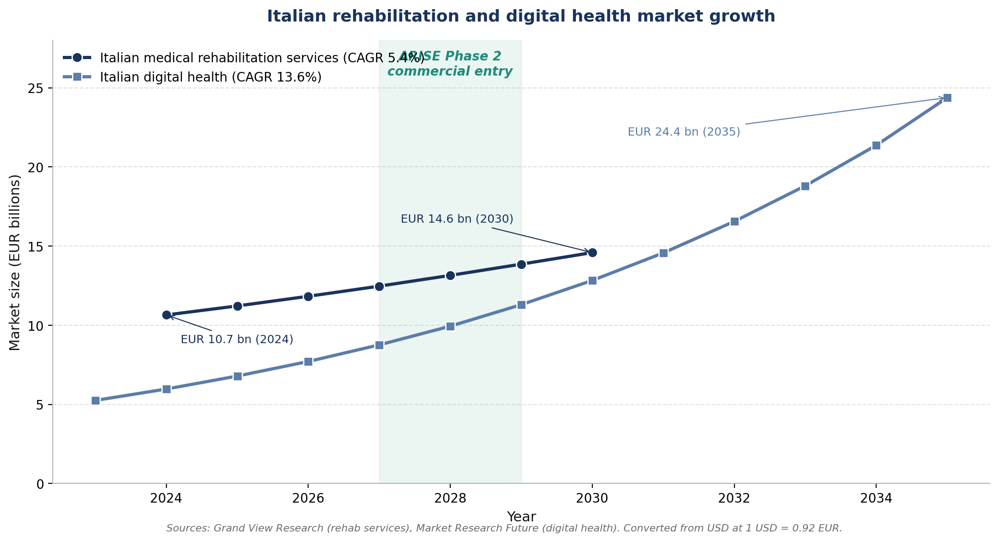
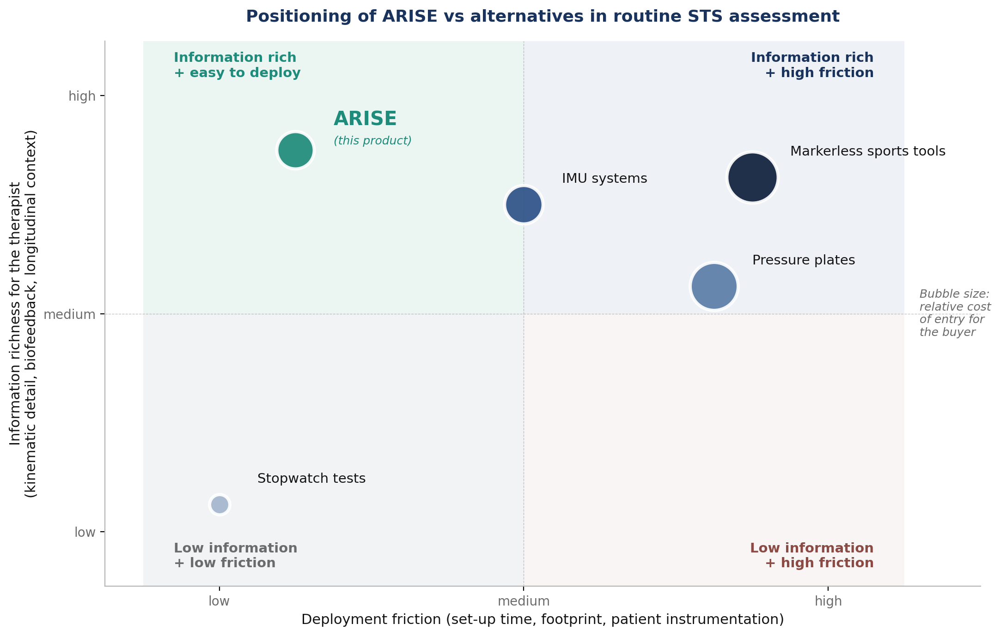
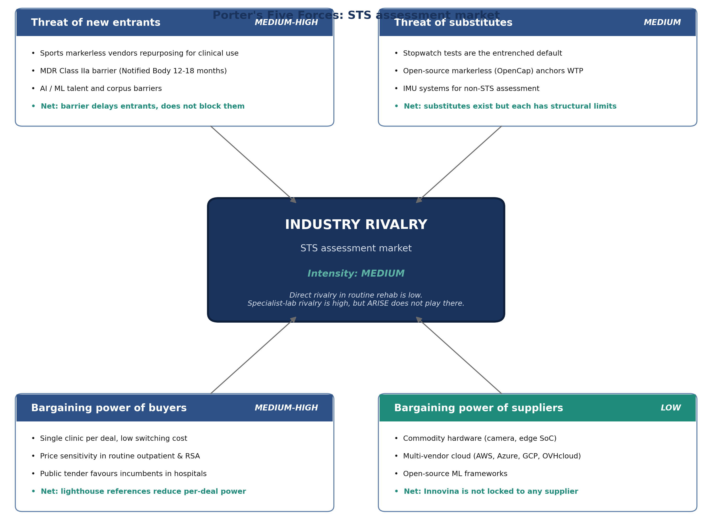
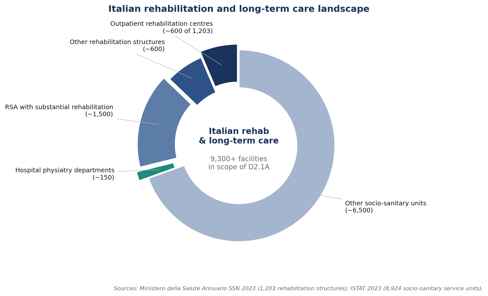
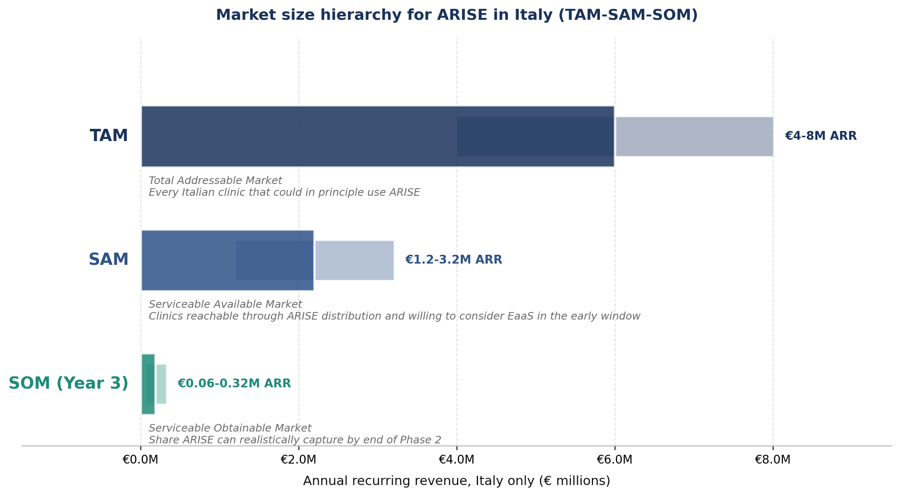
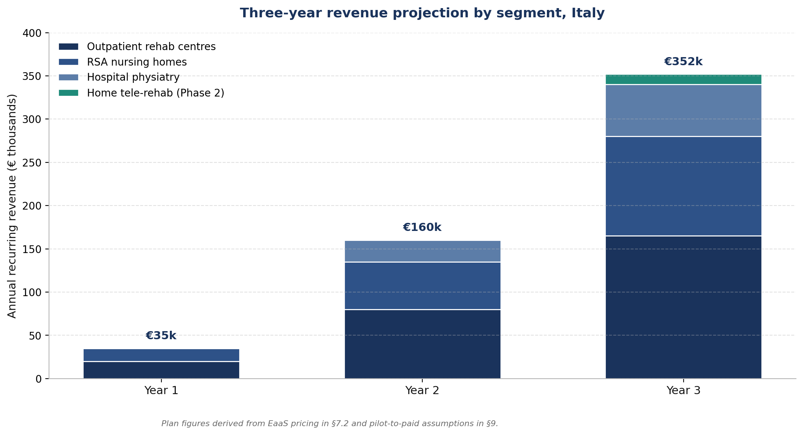
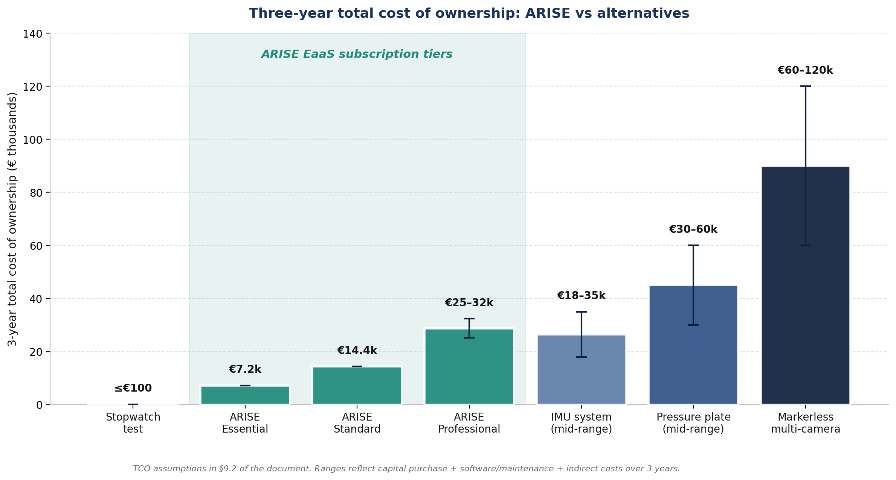
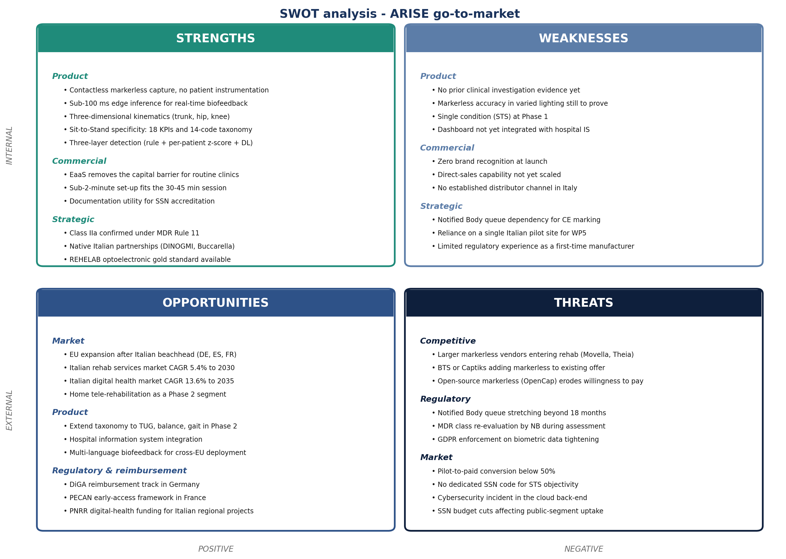
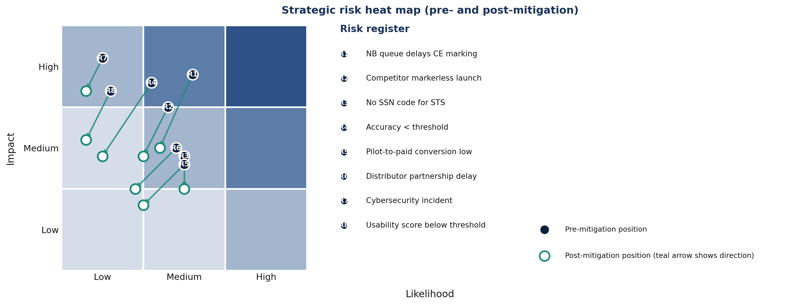

# D2.1A Market Analysis Document

## 1. Executive summary

The Italian medical rehabilitation services market was valued at **EUR 10.7 billion in 2024** and is projected to reach **EUR 14.6 billion by 2030** (CAGR 5.4%). The parallel Italian digital health market has grown from EUR 2.3 billion in 2023 toward an estimated **EUR 24.4 billion by 2035** (CAGR 13.6%). These two trends frame the commercial window for ARISE: rehabilitation services are growing steadily, and the digital-health share of that spending is growing three times faster. (Source figures are originally published in USD by Grand View Research and Market Research Future; converted at 1 USD = 0.92 EUR.)

Routine Sit-to-Stand assessment in this market splits between **specialist laboratory tools** (pressure plates, force platforms, multi-camera markerless capture) that deliver objective measurement at very high cost and footprint, and **the stopwatch-and-clipboard baseline** that dominates the routine rehabilitation gym, the RSA nursing home, and the smaller hospital physiatry department. Between those two extremes sit **inertial measurement units**, accurate but burdened by patient-worn sensors awkward for elderly and post-stroke populations, and **markerless 3D motion capture**, an emerging category dominated by sports-performance vendors repurposing their products for clinical use. ARISE enters this market as a **single-camera, markerless, edge-processed system designed specifically for the Sit-to-Stand transfer**, with real-time audiovisual biofeedback during the transfer and a longitudinal clinical dashboard. Paired with an Equipment-as-a-Service commercial model at **€199 to €899 per month per device**, ARISE removes the capital-purchase barrier that has kept objective biomechanical measurement out of routine rehabilitation. The three-year total cost of ownership of an ARISE Essential subscription (**€7,164**) sits at **one-half to one-fifth** of a mid-range IMU system, **one-quarter to one-eighth** of a pressure-plate installation, and **one-eighth to one-seventeenth** of a multi-camera markerless installation. ARISE achieves these reductions without any patient-worn instrumentation and without the floor footprint that has kept the existing alternatives out of routine rehabilitation gyms (see §9 for the per-alternative TCO breakdown and the assumptions behind each figure).

The principal risks are bounded and addressed. **Regulatory** risk reduces to the Notified Body queue under the confirmed Class IIa pathway, mitigated by early Notified Body shortlisting at M14 and a six-month buffer in the Phase 2 plan. **Competitive** risk is dominated by larger markerless vendors entering rehabilitation, mitigated by locking in lighthouse Italian pilot clinics on multi-year subscriptions before the entrant pressure materialises. **Reimbursement** risk reduces to the absence of a dedicated SSN code for objective STS assessment, mitigated by positioning the value as operational efficiency and patient-facing premium rather than reimbursement uplift, with the German DiGA framework as the hedge for Phase 2. **Recommendation: proceed.** Italian outpatient rehabilitation centres and RSA nursing homes are the priority Year-1 targets; public hospital physiatry departments are a slower but higher-ticket parallel track; home tele-rehabilitation is sequenced as the Phase 2 expansion.

### 1.1 Market at a glance

| Item | Value | Source |
|---|---|---|
| Italian medical rehabilitation services market, 2024 | EUR 10.7 billion | Grand View Research (USD 11.57 bn converted) |
| Projected market by 2030 (CAGR 5.4%) | EUR 14.6 billion | Grand View Research (USD 15.86 bn converted) |
| Italian rehabilitation structures (all types) | 1,203 | Ministero della Salute, Annuario SSN 2023 |
| Italian socio-sanitary service units with rehabilitation | 8,924 | ISTAT, Strutture residenziali 2023 |
| Total Addressable Market (Italy, annual recurring revenue) | €4 to €8 million | Built bottom-up from the public counts above |
| Year-3 target Annual Recurring Revenue (Italy) | €1.2 to €3.2 million | Plan, see §6 |
| EaaS monthly fee per device (Essential to Professional) | €199 to €899 | Plan, see §7 |
| ARISE three-year total cost of ownership (Essential tier) | €7,164 | See §9 |
| Confirmed MDR class | Class IIa, Rule 11 | MDR Compliance Plan |

### 1.2 Italian rehabilitation services market growth

## 2. The STS assessment market: ARISE versus all alternatives

### 2.1 The four categories of STS assessment

Routine Sit-to-Stand assessment in Italian rehabilitation falls into four operational categories. Each occupies a different position in the trade-off between cost, deployment friction, and information richness.

| Category | What it is | Where it is found |
|---|---|---|
| Stopwatch and observational scoring | Five Times Sit-to-Stand and the 30-Second Chair Stand, executed by the therapist with a stopwatch and a clipboard | Universal across rehabilitation, including the 1,200+ Italian rehabilitation structures and the 9,000+ socio-sanitary service units |
| Pressure plates and force platforms | Floor-mounted devices that measure ground-reaction forces and load symmetry | Specialist biomechanics laboratories, advanced rehabilitation centres, sports-performance facilities |
| Inertial measurement units (IMU) | Body-worn sensors measuring acceleration and angular velocity at the limb segment | Research-grade clinical centres; emerging in advanced rehabilitation |
| Markerless 3D motion capture | Camera-based systems estimating the patient's three-dimensional skeleton without markers | Sports performance laboratories, biomechanics research, beginning to enter rehabilitation |

ARISE is positioned as a fifth, distinct category: **single-camera markerless, edge-processed, biofeedback-integrated, Sit-to-Stand-specific**. The remainder of §2 explains how ARISE compares to each of the four established categories.

### 2.2 Cross-category comparison

| Dimension | Stopwatch tests | Pressure plates | IMU systems | Markerless sports tools | ARISE |
|---|---|---|---|---|---|
| Capital cost of entry | Zero | High (tens of thousands of euros) | Medium-high | High | None (EaaS subscription) |
| Three-year total cost of ownership (see §9) | €0 to €100 | €30,000 to €60,000 | €18,000 to €35,000 | €60,000 to €120,000 | €7,164 (Essential) to €32,364 (Professional) |
| Set-up time per session | Seconds | 5-15 minutes | 5-10 minutes | 10-30 minutes | 1-2 minutes |
| Footprint in the clinic | Zero | 0.6-1.2 m² floor | Small but on-body | Multi-camera installation | Single camera on a tripod |
| Patient instrumentation | None | None (on plate) | Worn | None | None |
| Kinematic detail | None | None (kinetic only) | Full | Full | Full |
| Kinetic measurement | No | Yes (direct) | Indirect | No | No |
| Real-time biofeedback during the rep | None | None | Limited | None | Yes |
| Decision-support framing on output | None | Specialist graphs | Specialist | Specialist | Yes |
| STS-specific KPIs and error taxonomy | No | No | Generalised | No | Yes (D1.1 catalogue) |
| Longitudinal tracking across sessions | Manual | Single-session | Per-session | Single-session | Built-in |
| Therapist training burden | None | Multi-day | Multi-day | Multi-day | Single session |
| MDR class (typical) | n/a | Class IIa | Class I or IIa | Mixed | Class IIa (confirmed) |
| Fit for routine rehabilitation gym | High workflow, low information | Low (cost, footprint) | Medium | Low (cost, set-up) | High |

### 2.3 ARISE versus stopwatch tests

Stopwatch tests are the universal baseline in routine practice. They are free, fast, and validated by decades of clinical use. They produce a single scalar (time-to-stand or repetition count) and require no equipment beyond a chair, a stopwatch, and the clinician's eye. They are, in the strictest sense, **the competitor ARISE displaces in the largest number of clinics**.

The structural gap is information richness. A stopwatch tells the therapist that a patient took 14 seconds to perform five repetitions; it does not tell the therapist that the patient flexes the trunk insufficiently during the forward lean, that the right knee collapses medially under load, or that the descent is uncontrolled. ARISE captures these patterns in the 14-code error taxonomy of D1.1 and reports them on the clinical dashboard.

| Where ARISE wins versus stopwatch | What changes for the therapist |
|---|---|
| Kinematic detail at every repetition | Treatment progression decisions move from gestalt to evidence |
| Real-time biofeedback to the patient | The therapeutic intervention is delivered during the transfer, not just commented on after it |
| Longitudinal record | Adherence and progression are documented for referrers, insurers, and family caregivers |
| Documentation utility | Auditable, exportable records that support quality-of-care reporting under SSN accreditation |
| Error-code triage | The therapist's next-session plan targets the specific compensations seen this session |

Where the stopwatch still wins: in the lowest-resource clinics where any technology procurement is a barrier, and in episodic screening situations where a single timed test is all that is needed.

### 2.4 ARISE versus pressure plates and force platforms

Pressure plates and force platforms are the established objective-measurement tool in specialist biomechanics laboratories and the better-equipped rehabilitation centres. They deliver direct kinetic measurement and are validated by an extensive published literature.

| Dimension | Pressure plates and force platforms | ARISE |
|---|---|---|
| Primary measurement | Ground-reaction forces, centre of pressure | Three-dimensional kinematics of trunk, hip, knee |
| Cost of entry | Tens of thousands of euros, plus maintenance | EaaS subscription |
| Footprint | 0.6-1.2 m² fixed floor space | One camera on a tripod, no floor space |
| Set-up time | 5-15 minutes per session, plus calibration | 1-2 minutes per session |
| Output | Pressure maps and force-time curves requiring biomechanical interpretation | At-a-glance dashboard with KPIs, error codes, and longitudinal trend |
| Biofeedback | Post-session reporting | Real-time audiovisual cues during the transfer |
| Suitable for | Biomechanics laboratory, advanced rehabilitation centre | Routine rehabilitation gym, nursing home, clinical room |

ARISE is positioned **not as a substitute for pressure plates in specialist laboratories**, but **as the objective-measurement tool for clinics that today have none**. In those clinics the competitor is the stopwatch, not the pressure plate. Pressure plates retain two structural advantages — direct kinetic measurement (forces and pressure as physical quantities) and an installed base in specialist centres — and ARISE does not claim to displace them on those axes.

### 2.5 ARISE versus inertial measurement units (IMU)

IMU systems measure acceleration and angular velocity using small body-worn sensors. Vendors include Xsens (Movella), APDM Wearable Technologies (Clario), NorAxon, and the Italian native Captiks with the Movit System G1.

| Dimension | IMU systems | ARISE |
|---|---|---|
| Sensor location | Body-worn (5 to 17 sensors strapped to body segments) | Single camera at 1.5 to 3 metres |
| Patient instrumentation | Required, with correct placement and orientation | None |
| Set-up time per patient | 5-10 minutes for strap-on, orientation calibration | 1-2 minutes for camera positioning |
| Patient-population fit | Awkward for elderly, post-stroke, and reduced-dexterity patients | Compatible with all populations who can perform the STS transfer with normal supervision |
| Drift during a session | Sensor drift requires periodic re-calibration | Per-frame estimation does not drift |
| Real-time biofeedback | Limited by sensor-to-display latency | Sub-100 millisecond on the edge |
| MDR class | Class I to IIa depending on labelled use | Class IIa (confirmed) |

The IMU usability burden is the single largest gap ARISE closes against this category. In a geriatric rehabilitation context, strapping multiple sensors to a patient with cognitive impairment, balance issues, or limited dexterity adds five to ten minutes per session and a non-trivial source of session failure (loose strap, sensor that fell off, patient discomfort that ends the session early). ARISE eliminates that burden entirely.

Where the IMU still wins: in research settings where multi-segment kinematic resolution beyond what a single camera can see is required, and in dynamic settings (gait, sports) where the patient moves through spatial environments that exceed the camera's field of view.

### 2.6 ARISE versus markerless 3D motion-capture systems

Markerless 3D motion capture is the newest competitor category and the one most similar to ARISE in raw capability. Vendors include Theia Markerless, Kinatrax, DARI Motion, the markerless extension of Movella, and the open-source OpenCap from Stanford. The category is dominated by **sports-performance products repositioned into clinical claims**, not by tools built for routine rehabilitation.

| Dimension | Markerless sports-derived tools | ARISE |
|---|---|---|
| Camera setup | 8 to 12 calibrated cameras in a fixed laboratory layout | One camera on a tripod, configurable per room |
| Set-up time | 10 to 30 minutes per session, plus multi-camera calibration cycle at install | 1 to 2 minutes per session |
| Footprint | Laboratory installation, often a dedicated room | None beyond the camera tripod |
| Task specificity | Generalised motion-capture pipeline | STS-specific KPIs, error taxonomy, and dashboard out of the box |
| Edge processing | Off-board cloud or workstation | On-device edge processing |
| Biofeedback during the transfer | Not provided | Built-in |
| Pricing model | Capital purchase plus per-camera annual subscription | EaaS subscription per device |
| Buyer | Sports performance lab, biomechanics research group | Routine rehabilitation centre, nursing home, hospital physiatry |

The structural differentiator is **purpose-built versus repositioned**. A sports-performance system sold to a rehabilitation clinic does the kinematic capture well but does not deliver the Sit-to-Stand-specific clinical interpretation that a therapist needs in routine practice. ARISE is built for the Sit-to-Stand task, supervised by a rehabilitation professional, in a routine clinical room.

### 2.7 Positioning map

The positioning map plots the four established categories and ARISE on two axes: **deployment friction** (set-up time, footprint, patient instrumentation, low is good) and **information richness for the therapist** (kinematic detail, biofeedback, longitudinal context, high is good). Bubble size reflects relative cost of entry.

**The upper-left quadrant is empty in the established market.** Stopwatch tests sit in the lower-left (low friction, no information). Pressure plates, IMU systems, and markerless sports tools all sit on the right of the map: high information at the cost of high friction. ARISE occupies the upper-left quadrant alone, delivering information richness comparable to the high-friction tools without their deployment cost. This is the structural gap that defines the commercial opportunity: ARISE is not just a cheaper version of the existing tools, it is the first product designed to fit the upper-left quadrant.

## 3. Competitor landscape (vendor-level)

The vendor-level mapping below names the specific commercial actors ARISE will encounter. Public list prices are rare in this category; pricing is typically quote-based via distributors. Italian footprint claims are based on the distribution chain documented in §13 sources; where verifiable installed-base counts are not publicly available, the entry is described as "Channel evidence" rather than "Installed base".

### 3.1 Pressure-plate and force-platform vendors

| Vendor | Country | Pricing reality | MDR class | Italian channel and footprint evidence |
|---|---|---|---|---|
| Zebris Medical GmbH | Germany | List price not publicly disclosed; quote-based | Class IIa | Distributed in Italy via **Mariani Medical**, **Medicaltools** (Apulia), and **Tecnomedical**. FDM platform and FDM-T treadmill are the most-cited models in Italian rehabilitation distributor catalogues |
| Tekscan | United States | List price not publicly disclosed; secondary-market MatScan listings around USD 4,000 new and USD 800 used | Class IIa | Distributed in Italy via specialist channels; less prominent in rehabilitation distributor catalogues than Zebris |
| RsScan International (Materialise) | Belgium | List price not publicly disclosed; quote-based | Class IIa | More prevalent in podiatry and gait laboratories than in rehabilitation gyms |
| BTS Bioengineering | Italy (Milan) | List price not publicly disclosed; quote-based. P-6000 force platform and GAITLAB system | Class IIa | **Native Italian vendor**, spin-off of Politecnico di Milano (1986). Documented partnerships with Italian rehabilitation centres (e.g. TOG paediatric neurorehabilitation, Milan) and academic institutions (Politecnico di Bari) |
| AMTI | United States | List price not publicly disclosed; quote-based | Class IIa | Research deployment in EU; minimal rehabilitation-gym presence |

**Strategic reading.** Zebris (via the Mariani Medical / Medicaltools / Tecnomedical distributor network) and BTS (as a domestic native vendor with strong academic ties) are the two realistic incumbents Italian buyers know. **BTS is a potential complementary partner** rather than a head-on competitor because its kinetic measurement does not overlap with ARISE's kinematic measurement.

### 3.2 IMU vendors

| Vendor | Country | Pricing reality | MDR class | Italian channel and footprint evidence |
|---|---|---|---|---|
| Xsens (Movella) | Netherlands | Quote-based; Awinda Clinical line | Class I to IIa | Research-grade in EU; clinical extension recent |
| APDM Wearable Technologies (Clario) | United States | Quote-based; Opal sensor packs | Class II | Clinical-research footprint; growing rehabilitation footprint |
| NorAxon | United States | Quote-based; combined IMU plus EMG | Class IIa | Specialist physiotherapy channel |
| Captiks | Italy (Rome) | Quote-based; Movit System G1 for gait analysis | Class IIa | **Native Italian vendor** focused on rehabilitation and hybrid IMU+video. Stated client base spans scientific research, medicine, industry, sports, clothing, and military. Specific installed-base count in Italian rehabilitation centres not publicly disclosed |

**Strategic reading.** Captiks is the closest Italian competitor on the inertial side. It still requires the patient to wear sensors, which is the usability gap ARISE closes by being contactless.

### 3.3 Markerless 3D motion-capture vendors

| Vendor | Country | Primary domain | Rehabilitation positioning |
|---|---|---|---|
| Theia Markerless | Canada | Sports performance and research; requires 8 to 12 calibrated cameras | Limited rehabilitation deployment due to multi-camera setup |
| Kinatrax | United States | Originally baseball pitching analysis; expanded to clinical gait | Not yet a rehabilitation-routine product |
| DARI Motion | United States | Multi-camera markerless for sports medicine and military | Some clinical pilots; not rehabilitation routine |
| Movella (markerless extension) | Netherlands | Repositioning from IMU into markerless | Industrial and sports primary; clinical expansion expected |
| OpenCap (Stanford research) | Open source | Two-smartphone setup, free | Not a commercial competitor but a research benchmark and a willingness-to-pay anchor in academic conversations |

**Strategic reading.** No direct match for ARISE in this category today. The single-task, single-camera, edge-processed, biofeedback-integrated positioning of ARISE is structurally different from sports-performance products repositioned into clinical claims.

### 3.4 Observational and stopwatch-based scoring

This is the **baseline ARISE displaces** in most clinics. There is no vendor and no price. The Five Times Sit-to-Stand and the 30-Second Chair Stand are used near-universally in geriatric and post-orthopaedic rehabilitation. The buyer's question in routine practice is not "ARISE or Zebris," it is **"ARISE or nothing more than a stopwatch and a clipboard."**

## 4. Industry structure: Porter's Five Forces

### 4.1 Force-by-force analysis

| Force | Intensity | Key drivers | Net reading and implication for ARISE |
|---|---|---|---|
| Industry rivalry | Medium (trending to Medium-High) | Direct rivalry in routine rehabilitation is low (no direct match for ARISE). Rivalry in specialist labs is high (Zebris, BTS, AMTI) but ARISE does not play there. Movella and Theia recognising the routine-rehab opportunity will lift intensity in Years 2 to 3 | Lock in lighthouse Italian clinics on multi-year contracts before larger markerless vendors notice the segment |
| Threat of new entrants | Medium-High | The MDR Class IIa pathway (Notified Body, 12 to 18 months) delays entry but does not block a vendor with existing MDR experience. AI and corpus barriers meaningful but not insurmountable. Most likely entrant profile: sports markerless vendor with MDR experience repurposing for clinical use | Speed-to-CE-marking and reference density matter more than feature breadth in Year 1 |
| Threat of substitutes | Medium | Stopwatch tests are the entrenched default substitute, deeply embedded in routine practice. Open-source markerless (OpenCap) anchors the lower bound of willingness-to-pay in academic conversations. IMU systems substitute for ARISE in non-STS assessment but not for the specific STS workflow | The displacement story to a buying clinic is "ARISE versus stopwatch", not "ARISE versus IMU" |
| Bargaining power of buyers | Medium-High | Each deal involves one clinic, which has high relative power before reference density builds. Price sensitivity is high in routine outpatient and RSA segments where the alternative is zero cost. Hospital sales follow public tender processes (9 to 18 month cycle) that favour incumbents | Lighthouse references and signed multi-year subscriptions are the primary lever to reduce per-deal buyer power |
| Bargaining power of suppliers | Low | Camera and edge SoC hardware is commodity, with multiple vendors at the relevant price points. Cloud infrastructure has multi-vendor optionality (AWS, Azure, GCP, OVHcloud for EU data residency). The ML stack is open-source-dominant (PyTorch, ONNX, OpenCV) | Innovina is not locked in to any supplier on any layer of the stack |

### 4.2 Strategic implication

The two forces that most constrain ARISE's commercial trajectory are **buyer power** and **threat of entrants**. Both are addressed by the same lever: **building reference density in lighthouse Italian clinics ahead of the competitor pressure**. Each lighthouse customer reduces buyer power in subsequent deals (through social proof) and raises the entrant's cost of acquiring a comparable reference. **Commercial priority for Year 1 is therefore lighthouse-clinic acquisition, not topline revenue.**

## 5. Target market segments: deep profiles

### 5.1 Italian rehabilitation segment breakdown

### 5.2 Outpatient rehabilitation centres (Centri di Riabilitazione Ambulatoriali)

| Field | Detail |
|---|---|
| Buyer roles | Economic buyer: owner-operator (private) or clinical director (public). Technical evaluator: senior physiotherapist. End user: full physiotherapy team. Internal sponsor: senior physiotherapist most engaged with documentation and quality reporting |
| Typical size | 2 to 8 physiotherapists per centre, serving 60 to 250 active patients |
| Decision criteria (top 5) | (a) operational efficiency per session, (b) documentation utility for SSN accreditation, (c) patient-facing premium (private-pay segment), (d) cost predictability of EaaS versus capital purchase, (e) workflow disruption during set-up |
| Sales cycle length | 6 to 12 weeks from first contact to signed pilot; 3 to 6 months from pilot to multi-year subscription |
| Expected annual recurring revenue per centre | €2,400 to €4,800 (Essential to Standard tier × 12 months, single device per centre) |
| Current alternatives in use | Stopwatch tests universal; pressure plates present in fewer than 10% of centres (channel-evidence estimate, to be validated in pilot) |
| ARISE value proposition (segment-specific) | Removes the capital barrier; provides documentation utility supporting SSN accreditation and private-payer premium |
| Win factors | EaaS pricing predictability; sub-2-minute set-up that fits the existing session; documentation utility |
| Loss factors | Internal sponsor turnover; competitor price drop; centre closure or merger |
| Source: structural count | 1,203 total rehabilitation structures in Italy, of which an estimated 600 to 900 are outpatient centres (Ministero della Salute Annuario SSN 2023; outpatient share is an internal estimate from the structural distribution) |

### 5.3 Long-term care with rehabilitation services (RSA)

| Field | Detail |
|---|---|
| Buyer roles | Economic buyer: clinical director or corporate buyer for facility chains. Technical evaluator: head of rehabilitation. End user: facility physiotherapist. Internal sponsor: medical director who values fall-risk metrics |
| Typical size | 1 to 3 physiotherapists per facility, serving 30 to 120 elderly residents |
| Decision criteria (top 5) | (a) fall-risk reduction, (b) longitudinal tracking of geriatric STS performance, (c) family-facing documentation, (d) operational efficiency, (e) ease of use by non-specialist staff |
| Sales cycle length | 8 to 16 weeks for single facility; 4 to 6 months for chain group buy |
| Expected annual recurring revenue per facility | €2,400 to €3,600 (Essential tier × 12 months, single device per facility) |
| Current alternatives in use | Stopwatch tests universal; pressure plates almost never present in this segment |
| ARISE value proposition (segment-specific) | Direct alignment with fall-risk reduction and longitudinal geriatric tracking, the two outcomes the medical director values most |
| Win factors | Family-facing documentation; alignment with quality-of-care reporting; corporate chain economics |
| Loss factors | Facility budget freeze; staff turnover that loses the internal sponsor; corporate procurement reset |
| Source: structural count | 8,924 socio-sanitary service units providing rehabilitation, with approximately 319,000 beds (ISTAT 2023). An estimated 1,500 to 2,500 of these have rehabilitation as a substantial activity (internal estimate based on bed-share and activity profile) |

### 5.4 Public hospital physiatry departments

| Field | Detail |
|---|---|
| Buyer roles | Economic buyer: hospital procurement office. Technical evaluator: physiatry-department head and biomechanics specialist. End user: physiotherapy team. Internal sponsor: biomechanics-trained physiotherapist or physiatrist |
| Typical size | 5 to 20 physiotherapists; one or more biomechanics-trained specialists |
| Decision criteria (top 5) | (a) scientific evidence base, (b) integration with hospital information systems, (c) compliance with regional procurement standards, (d) total cost of ownership, (e) post-market vigilance and support |
| Sales cycle length | 9 to 18 months (public-tender process) |
| Expected annual recurring revenue per department | €8,400 to €10,800 (Professional tier × 12 months, with multi-device discount applied) |
| Current alternatives in use | Mixed; the better-equipped centres already have pressure plates and use them in research-adjacent assessment |
| ARISE value proposition (segment-specific) | Complement to existing pressure plates; brings real-time biofeedback and routine-session compatibility that the laboratory tools cannot deliver |
| Win factors | Scientific endorsement from DINOGMI; tender-compatible Class IIa documentation; HIS integration capability |
| Loss factors | Tender delay or cancellation; competitor lobbying through established channel; regional budget freeze |
| Source: structural count | Approximately 150 public hospital physiatry departments in Italy (Innovina internal estimate; precise count is not published as a single dataset by the Ministero della Salute) |

### 5.5 Home tele-rehabilitation (Phase 2 strategic segment)

| Field | Detail |
|---|---|
| Buyer roles | Phase 2a: rehabilitation operator extending tele-rehab. Phase 2b: direct-to-patient via clinic-prescribed subscription |
| Typical size | One patient, one camera, one tablet at home |
| Decision criteria | Phase 2a: operator's tele-rehab strategy. Phase 2b: clinician prescription and reimbursement track (DiGA in Germany would be the lead reimbursement-supported market) |
| Sales cycle | Phase 2a: B2B operator contract. Phase 2b: depends on reimbursement framework |
| Expected ARPU | Phase 2a: €25 to €50 per patient per month under operator licence. Phase 2b: depends on DiGA pricing |
| Current alternatives | Emerging; no incumbent product specifically for STS home tele-rehab |
| ARISE value proposition | The same Coach edge device deployed at home; consent framework adapted; new licensing model |
| Not addressable in Phase 1 of the project | This segment is a follow-on market, sequenced after CE marking and the Italian beachhead are established |

### 5.6 Adjacencies (out of scope for Phase 1)

| Adjacency | Why excluded from Phase 1 |
|---|---|
| Sports performance and elite athletic training | The markerless category already competes here with established products |
| Industrial ergonomics | IMU systems dominate; medical-device positioning of ARISE is not the right fit |
| Veterinary rehabilitation | Small niche; not aligned with the medical-device classification |

## 6. Market sizing

### 6.1 TAM-SAM-SOM

| Layer | Plain-language meaning | Italian value |
|---|---|---|
| TAM (Total Addressable Market) | Every Italian clinic that could in principle use ARISE if money and adoption were no obstacle | €4 to €8 million annual recurring revenue |
| SAM (Serviceable Available Market) | The share of the TAM ARISE can realistically reach through its distribution channels and that is willing to consider EaaS in the early-adoption window | €1.2 to €3.2 million annual recurring revenue (30-40% of TAM) |
| SOM (Serviceable Obtainable Market) | The share ARISE can realistically capture in Years 1 to 3 against competitor activity and inertia | €60,000 to €320,000 annual recurring revenue (5-10% of SAM) by Phase 2 exit |

### 6.2 How the TAM was built (bottom-up)

| Segment | Approximate count (sources cited in §13) | Indicative annual spend per centre on objective-assessment tooling | TAM contribution |
|---|---|---|---|
| Outpatient rehabilitation centres | 600 to 900 outpatient centres within the 1,203 total rehabilitation structures | €3,000 to €6,000 | €1.8 to €5.4 million |
| RSA nursing homes with rehabilitation | 1,500 to 2,500 facilities within the 8,924 socio-sanitary service units | €2,000 to €4,000 | €3.0 to €10.0 million |
| Public hospital physiatry departments | Approximately 150 departments | €5,000 to €12,000 | €0.75 to €1.8 million |
| Home tele-rehabilitation pilots | Not sized in Phase 1 | n/a | n/a |

The TAM stated as €4 to €8 million in §6.1 takes a conservative midpoint across these ranges, applying a discount for the share of facilities that do not run an active rehabilitation programme that would benefit from ARISE.

### 6.3 Three-year revenue projection by segment

The revenue trajectory is driven by lighthouse-customer conversion in Year 1, segment expansion in Year 2, and hospital and home-rehab entry in Year 3. The trajectory reaches **€352k annual recurring revenue at end of Year 3**, sitting comfortably within the SOM range stated in §6.1.

### 6.4 EU27 expansion sequencing

After the Italian beachhead is established and CE marking is confirmed in Phase 2, the natural expansion sequence is built on **shared regulatory framework (MDR) and similar rehabilitation infrastructure**, not on raw market size alone. The sequencing logic and the country-specific entry rationale are:

| Sequencing tier | Country | Entry rationale |
|---|---|---|
| Tier 1, Year 1 of EU expansion | Spain, Portugal | Closest healthcare-system parallels with Italy; bundled reimbursement model translates without adaptation; Latin-language UI port at low cost |
| Tier 1, Year 1 of EU expansion | Germany | DiGA framework is the most attractive reimbursement opportunity in the EU; clinical evidence from Italy supports the DiGA application; large rehabilitation market |
| Tier 2, Year 2 of EU expansion | France | PECAN early-access framework for digital therapeutic tools; French clinical evaluation needed |
| Tier 2, Year 2 of EU expansion | Netherlands, Belgium | English-friendly regulatory and clinical environments; smaller absolute size but high digital-health receptivity |
| Tier 3, Year 3+ | Nordic countries, Austria | Smaller markets; sequenced after the core EU positions are established |

The EU TAM extrapolation (€40 to €80 million annual recurring revenue) referenced in earlier versions of this document is a planning placeholder, not a forecast: per-country TAM estimates are validated as each country's distribution channels are engaged.

## 7. Equipment-as-a-Service (EaaS) go-to-market

### 7.1 Why subscription instead of hardware sale

| Reason | What it gives ARISE |
|---|---|
| Cash-flow alignment with clinic budgets | A clinic with a small operating budget can absorb a monthly fee that a capital purchase would block at the board or chamber-of-commerce level |
| Faster product iteration | The device fleet stays under Innovina's update control; software improvements ship to every customer at once |
| Recurring revenue | Predictable revenue base that investors and credit lines reward, versus episodic hardware-sale revenue |
| Service and support bundled | One subscription covers software updates, helpdesk, and replacement units if hardware fails |
| Aligns with the regulatory PMS plan | The EaaS contract gives Innovina the legal and technical basis to collect the post-market surveillance telemetry required by MDR Articles 83 to 86 |
| Sustains MDR Class IIa software updates | A subscription model can be updated continuously without changing the customer's contractual position, which matters for Class IIa software under MDR Article 23 traceability |

### 7.2 Pricing tiers

| Tier | Target segment | Monthly fee per device | What is included |
|---|---|---|---|
| Essential | Single-practice clinic, RSA | €199 per month | Coach device, dashboard access for one therapist, software updates, business-hours helpdesk |
| Standard | Multi-practitioner outpatient centre | €399 per month | Multiple therapist seats, multi-patient longitudinal dashboard, extended-hours helpdesk, on-site replacement if hardware fails |
| Professional | Hospital physiatry, multi-site groups | €699 to €899 per month | Unlimited therapist seats, multi-site administration, API access for hospital information systems, dedicated account manager |

Annual prepay discount of 10-15%. Multi-device discount of 10-20%. Pilot price of 50% off for 60 days for the first ten Italian pilot clinics in exchange for a signed multi-year subscription on successful pilot.

### 7.3 Channel strategy

| Channel | Role |
|---|---|
| Direct sales | Initial pilot customers, hospital tenders, lighthouse references |
| Specialist medical-equipment distributors | The dominant route into routine outpatient rehabilitation in Italy |
| BTS Bioengineering and complementary vendors | Potential complementary partnership; ARISE's kinematic measurement does not overlap with BTS's kinetic measurement |
| Tele-rehabilitation operators | Phase 2 forward, as the home segment is addressed |
| Academic and clinical reference network | DINOGMI as scientific reference, Studio Buccarella as clinical reference; expanded to a small reference-clinic network in the first commercial year |

## 8. Reimbursement landscape

### 8.1 Italy

| Aspect | Status (2025-2026) |
|---|---|
| Dedicated reimbursement code for objective STS assessment | None. STS assessment is bundled into the general physiotherapy session billing |
| LEA (Livelli Essenziali di Assistenza) coverage | Outpatient rehabilitation sessions are covered with co-pay under the conditions defined in DPCM 12 gennaio 2017, updated for 2025 by the new LEA decree (in force from 30 December 2024) |
| SSN ticket for a standard physiotherapy cycle | Approximately €36.15 for a 10-session cycle |
| Private-pay session | €20 to €100 per session, depending on specialisation, location, and treatment type |
| Inpatient rehabilitation | DRG-based lump sum per discharge; no per-procedure reimbursement |

**Strategic implication.** ARISE's value proposition to the SSN-funded outpatient centre is **operational efficiency and treatment-progression objectivity**, not direct reimbursement uplift. To the private-pay clinic, the proposition is **differentiation and patient-facing premium**, supporting a higher session fee.

### 8.2 EU comparators

| Country | Reimbursement framework for digital health | ARISE relevance |
|---|---|---|
| Spain | Bundled into general physiotherapy session billing, similar to Italy | Italian model translates directly |
| Portugal | Bundled, similar to Italy | Italian model translates directly |
| France | PECAN early-access framework for digital therapeutic tools | Phase 2 opportunity; requires French-language clinical evaluation |
| Germany | DiGA (Digital Health Applications) framework with explicit prescription codes assigned by BfArM | **Most attractive non-Italian reimbursement opportunity for ARISE in Phase 2** |
| Nordics | Reimbursement varies; Sweden and Denmark most receptive to digital health | Phase 2 opportunity |

## 9. Pricing benchmark and total cost of ownership

This section presents the three-year total cost of ownership (TCO) for ARISE and for each of the four established alternatives. TCO is calculated from the buyer's perspective: what the clinic actually spends from contract signature to the end of Year 3. Every figure rests on explicit assumptions documented in §9.2; figures cited as "channel evidence" are based on Italian-distributor pricing visibility rather than on vendor list prices.

### 9.1 Three-year TCO comparison

### 9.2 TCO assumptions per alternative

| Alternative | Capital purchase | Annual software, maintenance, or service | Annual indirect cost (training, calibration, downtime) | Three-year TCO | Evidence base |
|---|---|---|---|---|---|
| **Stopwatch tests** | €0 (stopwatch, chair, clipboard already on site) | €0 | €0 to €100 (replacement stopwatch, paper forms) | **€0 to €100** | Universal practice; cost is the labour of the therapist, already on payroll |
| **ARISE Essential** | €0 (EaaS, no purchase) | €199 per month × 36 = €7,164 | €0 (software updates, helpdesk, hardware replacement included) | **€7,164** | Plan §7.2 |
| **ARISE Standard** | €0 (EaaS) | €399 per month × 36 = €14,364 | €0 (extended-hours helpdesk, on-site replacement included) | **€14,364** | Plan §7.2 |
| **ARISE Professional** | €0 (EaaS) | €699 to €899 per month × 36 = €25,164 to €32,364 | €0 (unlimited seats, HIS integration, dedicated account manager included) | **€25,164 to €32,364** | Plan §7.2 |
| **IMU system, mid-range (e.g. Xsens Awinda Clinical or Captiks Movit System)** | €15,000 to €25,000 capital purchase | €2,000 to €5,000 software subscription; €1,000 to €1,500 annual calibration | €500 to €1,500 therapist training amortised over 3 years | **€18,000 to €35,000** | Italian distributor channel evidence; Captiks pricing not publicly disclosed; Xsens via authorised resellers |
| **Pressure plate, mid-range (e.g. Zebris FDM platform or BTS P-6000)** | €15,000 to €30,000 capital purchase for a single FDM platform; €30,000 to €50,000 for an FDM-T treadmill bundle | €1,500 to €3,000 maintenance contract per year; €500 to €1,000 calibration | €1,000 to €2,000 therapist training amortised over 3 years | **€30,000 to €60,000** (single FDM); higher for FDM-T treadmill | Channel evidence via Italian distributors Mariani Medical, Medicaltools, Tecnomedical |
| **Markerless multi-camera (e.g. Theia Markerless or DARI Motion)** | €25,000 to €60,000 capital purchase for 8 to 12 cameras plus workstation | €5,000 to €15,000 software subscription per year | €2,000 to €4,000 calibration and installation amortised over 3 years | **€60,000 to €120,000** | Quote-based; sports-performance installations referenced as a proxy |

### 9.3 Three commercial points the TCO comparison demonstrates

| Point | Detail |
|---|---|
| ARISE Essential undercuts every objective alternative by a wide margin | At €7,164 three-year TCO, ARISE Essential is **half to one-fifth** of the cheapest objective alternative (IMU mid-range at €18,000 to €35,000) and **one-quarter to one-eighth** of a pressure-plate installation |
| ARISE Standard remains below the cheapest IMU TCO while delivering biofeedback and STS-specific clinical output that the IMU does not | At €14,364, ARISE Standard is below the IMU floor (€18,000) and adds real-time biofeedback plus the dashboard, neither of which the IMU offers |
| ARISE Professional, designed for hospital deployment with multi-seat licensing and HIS integration, sits at half the cost of a multi-camera markerless installation | At €25,164 to €32,364, ARISE Professional sits **below the floor** of a multi-camera markerless installation (€60,000 to €120,000) while delivering the routine-session compatibility that the markerless category cannot |

### 9.4 Why ARISE pricing tiers are defensible

The pricing tiers in §7.2 are anchored on three reference points:

| Anchor | What ARISE pricing must do |
|---|---|
| The amortised monthly cost of a pressure-plate purchase (capital €15-50k amortised over 5 years plus maintenance: €300 to €1,000 per month) | The ARISE Essential tier at €199 per month is below the amortised pressure-plate monthly cost in every reasonable scenario |
| The three-year total cost of a competitor IMU system (€18-35k) | The three-year ARISE Essential TCO (~€7,200) is one-half to one-fifth of the IMU TCO while removing the patient-worn instrumentation burden |
| The zero-equipment baseline of stopwatch testing (€0 to €100) | Each euro of ARISE monthly subscription must be justified against this baseline through the longitudinal dashboard, the biofeedback intervention, and the documentation utility for referrers and family caregivers |

### 9.5 Pilot pricing programme

The **pilot programme** offers 50% off for 60 days (€99 Essential, €199 Standard, €349 Professional) to the first ten Italian pilot clinics in exchange for: (a) a signed multi-year subscription if the pilot succeeds, and (b) consent to use the clinic as a public reference for the broader commercial launch. The programme seeds the lighthouse customer base on which Year 1 sales rely.

## 10. SWOT analysis

The SWOT decomposes each quadrant into product, commercial, and strategic / regulatory sub-categories. **Strengths** are anchored on the product properties (contactless, edge, STS-specific) and the regulatory positioning (Class IIa confirmed). **Weaknesses** centre on first-time-manufacturer risks and the absence of prior clinical evidence. **Opportunities** spread across market expansion (EU), product extension (TUG, balance, gait), and reimbursement (DiGA, PECAN). **Threats** are dominated by competitor entry and regulatory timing.

## 11. Strategic risks

### 11.1 Risk register

| ID | Risk | Mitigation | Risk owner |
|---|---|---|---|
| R1 | Notified Body queue delays CE marking by 6 to 12 months beyond plan | Notified Body shortlist at M14; pre-submission meeting M18 to M20; 6-month buffer in Phase 2 plan | PRRC |
| R2 | Competitor markerless launch positioned at the same clinic segment | Lock in early Italian pilot clinics with multi-year contracts; build referral network from DINOGMI and Studio Buccarella; differentiate on STS-specific clinical-error taxonomy | Commercial Lead |
| R3 | No SSN reimbursement code for objective STS assessment | Position value as operational efficiency and patient-facing premium; pursue DiGA in Germany as a hedge | Commercial Lead |
| R4 | Markerless accuracy below Validation Acceptance Criteria threshold | Corpus diversity strategy in T1.3; bench testing under varied conditions; conservative acceptance threshold negotiated with DINOGMI | ML Lead |
| R5 | Pilot-to-paid conversion below 50% | Two-month half-price pilot conditional on signed multi-year subscription on success; reference-clinic incentive programme | Commercial Lead |
| R6 | Distributor partnership delayed beyond commercial launch | Direct-sales capability built in parallel with distributor recruitment; lighthouse-customer model independent of a distributor | Commercial Lead |
| R7 | Cybersecurity incident in cloud back-end | Penetration testing per the DPIA; ISO 27001 alignment target for Innovina infrastructure during Phase 2 | CTO and DPO |
| R8 | Therapist or patient usability score below threshold in WP5 | Formative usability cycles before WP5 freeze; biofeedback deactivation option built into the user interface | Product Lead |

## 12. Conclusion and Phase 2 launch gating criteria

The Italian rehabilitation market is structurally favourable to a markerless, single-camera, edge-processed, biofeedback-integrated product. The category leaders in pressure plates, IMUs, and markerless sports tools do not reach the routine outpatient and nursing-home segments because of cost, footprint, or instrumentation burden. The dominant baseline in those segments is the stopwatch test, against which any objective tool is a clear improvement. The EaaS commercial model removes the capital-purchase barrier and aligns ARISE's revenue with the budget cycle of the buyer.

The principal risks are regulatory timing (the Notified Body queue) and competitor activity from larger markerless or sports-performance incumbents repurposing for clinical use. Both are addressable through the engagement timing of the Notified Body (planned from M14 onward in the MDR Compliance Plan) and through early-adopter contracts that lock in a lighthouse Italian customer base.

**Recommendation: proceed.** Target Italian outpatient rehabilitation centres and nursing homes first; public hospital physiatry departments as a slower but higher-ticket parallel track; home tele-rehabilitation as a Phase 2 expansion.

### 12.1 Phase 2 launch gating criteria

| Criterion | Threshold |
|---|---|
| Pilot clinic willingness to subscribe at Essential or Standard tier | At least 3 of 5 pilot clinics confirm subscription intent during the WP5 demonstration |
| Therapist usability score | At or above the threshold in the Validation Acceptance Criteria |
| Detection performance | At or above the threshold in the Validation Acceptance Criteria |
| Markerless accuracy versus REHELAB reference | At or below the threshold in the Validation Acceptance Criteria |
| Notified Body engagement on track | Pre-submission meeting completed by M20 |

If those criteria are met, the commercial launch plan in Phase 2 proceeds. If two or more are not met, the strategic thesis is revisited and the commercial launch is replanned.

## 13. Sources

| Source | Used for |
|---|---|
| Grand View Research, Italy Medical Rehabilitation Services Market Size & Outlook, 2030 | Italian rehabilitation services market size (USD 11.6bn 2024, USD 15.9bn 2030, CAGR 5.4%) |
| Market Research Future, Italy Digital Healthcare Market Size, Growth Outlook 2035 | Italian digital health market (USD 6.49bn 2024 to USD 26.5bn 2035, CAGR 13.6%) |
| Ministero della Salute, Annuario Statistico del Servizio Sanitario Nazionale 2023 | Italian rehabilitation structure count (1,203) and bed counts |
| ISTAT, Le strutture residenziali socio-assistenziali e socio-sanitarie, dati 2023 | RSA / socio-sanitary unit counts (8,924 units, 407,957 beds) |
| DPCM 12 gennaio 2017 and the LEA decree in force from 30 December 2024 | LEA framework for outpatient rehabilitation |
| ilmiobusinessplan.com, costo della fisioterapia 2025 | SSN ticket figure (€36.15 per 10-session cycle) and private-pay range (€20 to €100 per session) |
| Tekscan online resale listings (eBay, Tekscan Store) | MatScan secondary-market pricing (USD 800 used, USD 4,000 new) |
| Zebris and h/p/cosmos product pages; Mariani Medical, Medicaltools, Tecnomedical (Italian distributors) | Zebris Italian channel evidence |
| BTS Bioengineering product catalogue; documented partnership with TOG (Milan paediatric neurorehab) and Politecnico di Bari | BTS Italian footprint evidence |
| Captiks Movit System product pages | Italian IMU-plus-video competitor identification |
| BfArM DiGA framework | Phase 2 German reimbursement opportunity |
| D1.1, T1.3, Compliance Dossier (DMP, DPIA, MDR Compliance Plan) | Clinical, biomechanical, and regulatory context referenced rather than duplicated |
