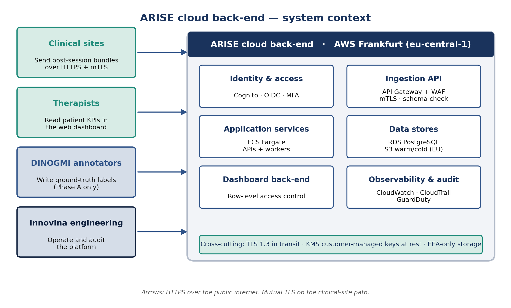
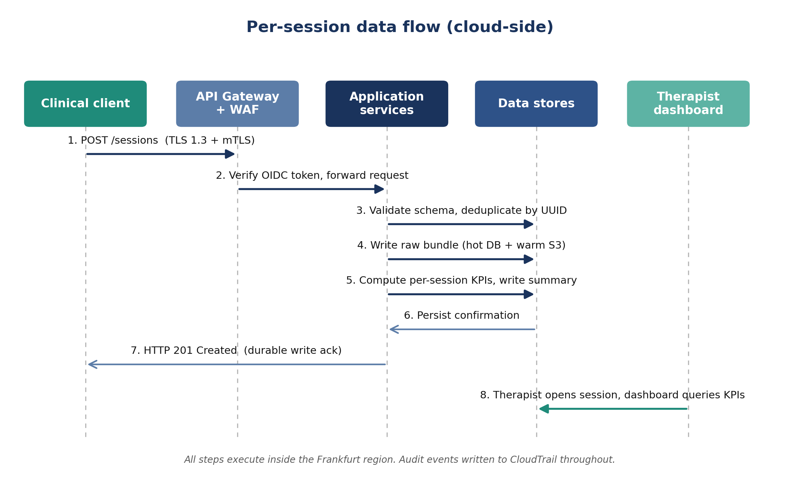
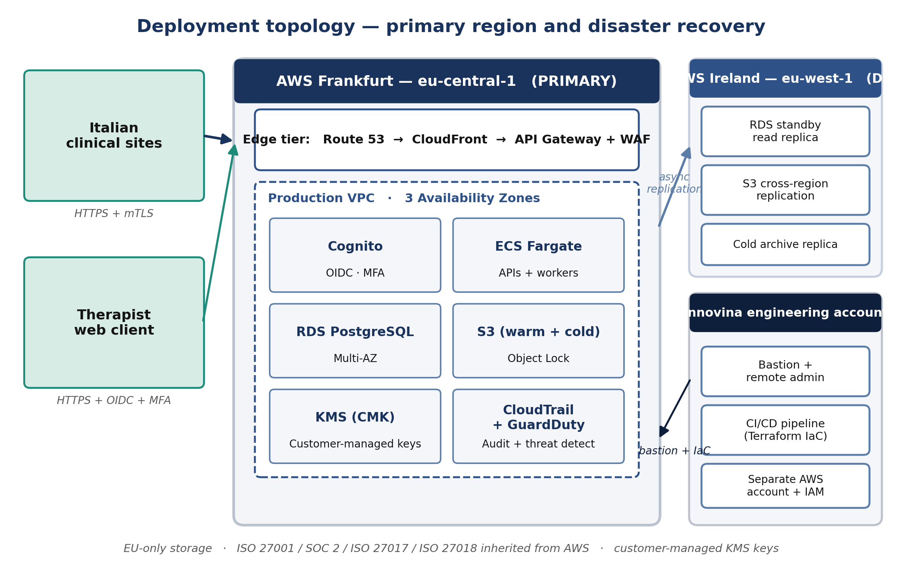

# D2.1B Cloud Architecture

## 1. Purpose and scope

This document specifies the cloud back-end of the ARISE system. The specification covers the reception, validation, storage, processing, and serving of per-session clinical data, the network and security architecture, the observability and service-level commitments, the deployment and scalability strategy, and the business-continuity provisions. The document is the engineering reference for Work Package 2 Task T2.1 and is the input to Work Package 4 prototype integration.

The cloud architecture is governed by two binding constraints. **Personal data of Italian patients must remain within the European Economic Area**, which rules out non-EU cloud regions for any storage of personal data. **The therapist dashboard must remain available during clinical hours**, which dictates multi-availability-zone deployment within the primary region and disaster-recovery replication to a secondary region within the EU.

## 2. Definitions and acronyms

| Term | Definition |
|---|---|
| AE | Adverse event, as defined in MDR Article 2(57) |
| AZ | Availability zone, an isolated infrastructure failure domain within a cloud region |
| CMK | Customer-managed key, a cryptographic key whose lifecycle is controlled by the customer rather than by the cloud provider |
| Coach client | A software process running at the clinical site that produces the per-session payload consumed by the cloud back-end |
| DR | Disaster recovery |
| GDPR | Regulation (EU) 2016/679 |
| GSPR | General Safety and Performance Requirements, MDR Annex I |
| IaC | Infrastructure as Code |
| MDR | Regulation (EU) 2017/745 |
| MFA | Multi-factor authentication |
| OIDC | OpenID Connect |
| PMS | Post-market surveillance |
| RPO | Recovery point objective |
| RTO | Recovery time objective |
| SLO | Service level objective |
| WAF | Web application firewall |

## 3. System architecture

### 3.1 Service composition

The back-end is composed of managed services within a single Amazon Web Services region (Frankfurt, eu-central-1) with disaster-recovery replication to a secondary EU region (Ireland, eu-west-1). The provider selection is documented in Section 5.

| Functional layer | Service | Specification |
|---|---|---|
| Ingress | API Gateway with WAF | TLS 1.3 termination, OWASP Top-10 protection, EEA geo-fencing, rate limiting per client and per source IP |
| Identity | Amazon Cognito with OIDC | Mandatory multi-factor authentication for all human accounts. Per-device X.509 certificates for non-human clients |
| Ingestion API | ECS Fargate, auto-scaled | JSON schema validation, deduplication, signed-write logging |
| Hot data store | RDS for PostgreSQL, Multi-AZ | Encrypted at rest with customer-managed KMS keys. Holds the schemas defined in DMP Section 5 |
| Warm object store | S3, EU region constraint | Holds corpus snapshots, per-session JSON bundles, and AE evidence packs. Object Lock applied to the annotated corpus |
| Cold archive | S3 Glacier Deep Archive | Retention per MDR Article 10(8) and DMP Section 6.4 |
| Aggregation worker | ECS Fargate, event-driven | Computes per-session KPI summaries, error counts, and quality scores |
| Dashboard back-end | ECS Fargate | Read-only API with row-level access enforced server-side |
| Audit log | CloudTrail and a dedicated PostgreSQL audit schema | Append-only, retained per DMP Section 8.1 |
| Observability | CloudWatch, CloudWatch Logs, AWS X-Ray, GuardDuty | Per Section 8 |
| Secrets management | AWS Secrets Manager | Automated rotation enabled for all stored credentials |
| Key management | AWS KMS | Customer-managed keys with annual rotation. A dedicated CMK isolates the AE description field, per DPIA Section 6.9 |

### 3.2 Selection of a managed cloud deployment model

An alternative hosting model would be a self-managed infrastructure operated by Innovina, either at a colocation facility or in an owned facility. This alternative was evaluated and rejected for the Phase 1 deployment on the following grounds.

**Procurement and certification timeline.** A self-managed deployment requires hardware procurement, colocation contracting, network engineering, redundant power and cooling provisioning, and an ISO 27001 certification process before any patient data may be hosted. A realistic timeline from project start to operational readiness is 9 to 12 months. WP5 deploys patients at M14 to M18. The procurement timeline is therefore incompatible with the WP5 schedule. A managed cloud deployment of equivalent scope is operational within days.

**Regulatory burden.** The Class IIa Annex IX assessment includes the hosting environment. Amazon Web Services holds the following attestations relevant to this assessment: ISO/IEC 27001, SOC 2 Type II, ISO/IEC 27017 (cloud-specific security controls), ISO/IEC 27018 (cloud privacy), HIPAA Business Associate Agreement, and the EU Cloud Code of Conduct. Each of these attestations represents a six-figure cost and a multi-month process for Innovina to demonstrate independently in a self-managed environment.

**Capital expenditure and operating model.** A redundant self-managed infrastructure with primary and disaster-recovery sites, twenty-four-hour security monitoring, and the associated operations staffing represents a capital expenditure of approximately EUR 150,000 to 300,000 and an operating headcount of three to four full-time engineers. The equivalent managed cloud deployment costs approximately EUR 500 to 2,000 per month at Phase 1 scale, requires no upfront capital expenditure, and is operable with an in-house headcount of zero to one.

**Conditions for re-evaluation.** A self-managed deployment becomes the appropriate model under two conditions. The first is a Phase 2 public-sector tender that mandates on-premises hosting as a procurement requirement. The second is a regulatory change that mandates Italian-territory hosting beyond what the EU residency commitment provides. The Infrastructure as Code described in Section 9.2 supports redeployment of the same architecture on Innovina-managed hardware, so the present decision does not preclude a future migration.

## 4. Application programming interface

The cloud back-end accepts payloads exclusively through the documented API contract. Any conformant client implementation may produce these payloads.

### 4.1 Wire format

Structured records use JSON over HTTPS. Binary artefacts (raw video, landmark streams) use binary multipart over HTTPS. JSON is selected over gRPC on three grounds: the per-session payload volume is low, the JSON tooling ecosystem is more accessible for diagnostic work, and the schema-validation infrastructure is more mature.

### 4.2 Payload types

| Payload | Schema reference | Trigger | Routing |
|---|---|---|---|
| Per-repetition KPI record | DMP Section 5.1 | End of session | Hot store, deduplicated by client-supplied UUID |
| Per-session metadata | DMP Section 5.2 | End of session | Hot store, one record per session |
| Annotation record | DMP Section 5.3 | DINOGMI annotator action | Hot store, separate authorisation scope |
| Adverse event record | DMP Section 5.4 | Clinical lead submission | Hot store, separate-key encryption per DPIA Section 6.9 |
| Landmark stream | Per-frame 33-landmark tensor with pipeline metadata | End of session, Phase A only | Warm object store, object-locked |
| Raw video | MP4 H.264 | End of session, Phase A only | Warm object store, dedicated prefix with retention per DMP Section 6.4 |

### 4.3 Authentication

Every request shall carry a per-device X.509 client certificate (mutual TLS) provisioned by Innovina and rotated annually, together with a bearer token in the Authorization header that is scoped to the authorised operations for the requesting client. The combination of mutual TLS and a scoped bearer token enforces both client identity and operational authorisation at the ingress boundary.

### 4.4 Schema versioning

Every payload shall carry a schema_version field. The ingestion API shall accept the current version and the immediately preceding version, supporting a single-version overlap during a coordinated client and back-end release. Breaking schema changes shall be released through a coordinated client and back-end deployment.

### 4.5 Idempotency

Every per-repetition and per-session payload shall carry a client-generated UUID. The ingestion API performs an idempotent insertion keyed on this UUID. A retry following a transient network failure shall not produce a duplicate record.

### 4.6 Bandwidth characteristics

| Payload type | Indicative size per session |
|---|---|
| Structured per-session bundle | Tens of kilobytes |
| Landmark stream (Phase A) | A few megabytes |
| Raw video (Phase A) | Tens of megabytes |

The clinical site requires upload bandwidth of approximately several megabits per second to complete the post-session upload within minutes. Lower bandwidth remains operationally acceptable, as the client retries with exponential back-off until acknowledgement.

## 5. Cloud service provider selection

### 5.1 Provider evaluation

Three EU-compliant cloud service providers were evaluated.

| Criterion | Amazon Web Services | Microsoft Azure | OVHcloud |
|---|---|---|---|
| EU data residency | Multiple EU regions | Multiple EU regions | EU-headquartered, sovereign-cloud option |
| Class IIa medical-device track record | Extensive | Established (Microsoft Cloud for Healthcare) | Limited |
| Managed-service catalogue breadth | Largest | Comparable | Narrower |
| Compliance attestations | ISO 27001, SOC 2 Type II, ISO 27017, ISO 27018, HIPAA, EU Cloud Code of Conduct | Equivalent set | ISO 27001, SOC 2, HDS (French health-data certification) |
| Italian regional presence | Milan region available | Italy North region available | Italian data centre available |

**Selected provider: Amazon Web Services.** The selection criterion that carries the greatest weight is the Class IIa medical-device track record under criterion two. The Notified Body conducting the Annex IX conformity assessment in Phase 2 will be presented with an audit dossier in which the hosting environment is Amazon Web Services Frankfurt. This pattern is well-established in the Notified Body community for Class II software as a medical device, reducing the time required for the technical-documentation review.

### 5.2 Region selection

**Selected primary region: eu-central-1 (Frankfurt). Selected disaster-recovery region: eu-west-1 (Ireland).**

The selection of Frankfurt over the alternative Milan region rests on three considerations.

The Frankfurt region has been generally available since 2014 and offers the complete catalogue of services required by the architecture, including RDS Multi-AZ across three availability zones, ECS Fargate, KMS with customer-managed keys, S3 Object Lock, and GuardDuty. The Milan region was launched in 2020 and presents a narrower catalogue with feature gaps relative to the services specified in Section 3.1.

Frankfurt has been the hosting region of record for many Class II medical-device software deployments audited by EU Notified Bodies. The technical-documentation review for an Annex IX assessment is faster when the hosting region is one for which the auditor holds prior assessment evidence.

The inter-region connectivity between Frankfurt and Ireland is the most extensively provisioned within the AWS European footprint, with documented latency and bandwidth characteristics that support the recovery point objective stated in Section 10.

### 5.3 Data residency constraints

| Constraint | Implementation |
|---|---|
| All personal data shall reside within the EEA | S3 bucket policies restrict regional placement to EU regions. RDS instances are provisioned exclusively in Frankfurt. Cross-region replication targets Ireland only |
| Personal data shall not be transferred to non-EEA processors | API Gateway WAF rules block requests originating outside the EEA as a defence-in-depth measure. The application layer enforces the same constraint |
| Sub-processor register shall be maintained per GDPR Article 28 | The Amazon Web Services service set in use is registered with the Data Protection Officer. New services require DPO approval prior to deployment |

## 6. Network architecture

### 6.1 Ingress

The back-end accepts inbound traffic on TCP port 443 only, through API Gateway behind the Web Application Firewall. The WAF shall enforce TLS 1.3 only, mutual TLS for client paths, anonymous TLS for the public dashboard login path, EEA geo-fencing, OWASP Top-10 protection, and per-client and per-source-IP rate limiting.

### 6.2 Internal network

The production Virtual Private Cloud is deployed across three availability zones with public and private subnets. Application and data tiers reside in private subnets and have no direct internet connectivity. Service-to-service communication uses mutual TLS where supported and AWS IAM-based authorisation for AWS-native services. Outbound calls to external services are routed through a NAT Gateway and logged.

### 6.3 Cross-region replication

Cross-region replication is configured for the hot store (RDS Multi-AZ with a cross-region read replica) and for the warm and cold object stores (S3 cross-region replication). The disaster-recovery region operates in read-only mode under normal conditions. The region-failover runbook is documented in Section 10.

## 7. Security architecture

### 7.1 Defence in depth

The security model is composed of five independent layers.

| Layer | Controls |
|---|---|
| Identity | Cognito with OIDC. Mandatory MFA for all human accounts. Per-device X.509 certificates for non-human clients |
| Network | TLS 1.3 for all data in transit. Mutual TLS for client-to-cloud paths. EEA geo-fencing at the WAF |
| Application | Schema validation at the ingestion boundary. Row-level authorisation at the dashboard back-end. Parameterised queries throughout |
| Data | AES-256 encryption at rest with customer-managed KMS keys. Dedicated KMS key for the AE description field per DPIA Section 6.9. Object Lock on the annotated corpus |
| Operational | Least-privilege IAM policies. Privileged sessions time-boxed to a maximum of four hours per DMP Section 8.2. Append-only audit logging |

### 7.2 Cybersecurity programme

MDR Annex I, GSPR 17.2 requires that medical-device software be developed and manufactured in accordance with the state of the art for cybersecurity. The ARISE cloud cybersecurity programme is structured around MDCG 2019-16 guidance, recognised by EU Notified Bodies, and the IMDRF Principles and Practices for Medical Device Cybersecurity.

| Activity | Cadence | Owner |
|---|---|---|
| Threat modelling using STRIDE methodology | At each major architectural change | Security lead |
| Penetration testing by a qualified third-party contractor | Before production go-live (M15), annually thereafter | Security lead |
| Vulnerability scanning | Continuous monitoring through managed services. Weekly bespoke scan | DevOps |
| Software composition analysis | Continuous within the CI/CD pipeline | DevOps |
| Incident response plan | Document drafted at M12. Tabletop rehearsal annually | DPO and Security lead |
| Coordinated vulnerability disclosure programme | Public from Phase 2 commercial launch | Security lead |

### 7.3 Key management

| Cryptographic key | Purpose | Rotation policy |
|---|---|---|
| Master CMK for general personal data | RDS, warm and cold object stores | Annual rotation |
| Dedicated CMK for AE description field | Adverse-event log encryption, isolated from general data | Annual rotation |
| Per-device X.509 client certificate | Mutual TLS for client-to-cloud paths | Annual rotation, automated provisioning |
| Therapist session tokens | OIDC access and refresh tokens | One-hour access token, eight-hour refresh token |

## 8. Observability

### 8.1 Telemetry

| Signal | Tool | Coverage |
|---|---|---|
| Rate, errors, duration metrics | CloudWatch and custom Prometheus exporters | Ingestion API, aggregation worker queue depth, database connection-pool utilisation |
| Application logs | CloudWatch Logs with structured JSON | Application execution, ingestion validation failures, dashboard requests |
| Distributed tracing | AWS X-Ray, OpenTelemetry-compatible | End-to-end request tracing across API, worker, and storage tiers |
| Audit log | CloudTrail and dedicated PostgreSQL audit schema | Every privileged access event and every deletion event |
| Security monitoring | GuardDuty | Anomalous API calls, unusual traffic patterns |
| Alerting | CloudWatch Alarms to PagerDuty | On-call rotation for ingestion failures, latency SLO breaches, AE escalation events |

### 8.2 Service level objectives

| Objective | Target |
|---|---|
| Ingestion API availability, monthly | Greater than 99.5 percent |
| Ingestion API p95 latency, excluding payload size | Below 500 milliseconds |
| Dashboard read latency, p95 | Below 1 second |
| AE escalation pager latency, form submission to on-call notification | Below 60 seconds |

## 9. Deployment and scalability

### 9.1 Scale envelope

| Phase | Sessions per day | Annual storage growth |
|---|---|---|
| Phase 1, WP4 and WP5 | 20 to 100 | Approximately 50 GB |
| Phase 2 Year 1 | 500 to 2,000 | Approximately 500 GB |
| Phase 2 Year 3 | 5,000 to 20,000 | Approximately 5 TB |

The selected managed services support this scale envelope without architectural change.

### 9.2 Deployment automation

| Aspect | Approach |
|---|---|
| Infrastructure as Code | Terraform. All cloud resources are declared in version-controlled code. No production console operations are permitted |
| Containerisation | Docker images for all application services, stored in Elastic Container Registry |
| Continuous integration and delivery | GitHub Actions executing build, test, security scan, staging deployment, manual approval, and production deployment stages |
| Environment separation | Development, Staging, Production environments with isolated AWS accounts |
| Release cadence | Continuous to Development and Staging. Scheduled weekly windows to Production with provision for hotfix releases |
| Rollback capability | Single-command rollback to the previous container image. Database migrations shall be forward-compatible |
| Configuration management | Parameter Store and Secrets Manager. No secrets in source code or container images |

## 10. Business continuity and disaster recovery

| Failure scenario | Target RPO | Target RTO | Recovery mechanism |
|---|---|---|---|
| Single-instance failure within the primary region | Zero | Below 5 minutes | RDS Multi-AZ failover, automatic ECS task replacement |
| Single availability-zone failure | Zero | Below 30 minutes | Multi-AZ deployment across three zones |
| Full primary-region failure | Below 15 minutes | Below 4 hours | Disaster-recovery region promoted to primary. DNS records updated. Therapist sessions resume in read-only mode, write capability restored on schema reconciliation |
| Accidental data deletion through operator error | Below 24 hours | Below 8 hours | RDS point-in-time recovery. S3 versioning with deletion protection |
| Cybersecurity incident requiring scope isolation | Scenario-dependent | Below 24 hours | Activation of the incident response plan. Cryptographic key rotation. Affected scope identified and isolated. Restoration from verified backups |

Disaster-recovery procedures shall be tested quarterly through a documented restore drill that includes a full point-in-time database restore to a parallel environment and validation of dashboard read correctness against the restored data.

## 11. Interfaces with downstream deliverables

| Downstream consumer | Interface provided by this document |
|---|---|
| WP3 AI training | Corpus storage layout, schema definitions, access path for the machine-learning training cluster, model-registry structure |
| WP4 TRL6 prototype | Cloud ingestion API contract, deployment automation |
| D2.2 UI/UX Specifications and Mockups | Data-availability specification for the dashboard, authentication flow, row-level access model |
| WP5 TRL6 Validation | In-trial observability dashboards, AE escalation pipeline, session-data export for Task T5.4 |
| Compliance Dossier | Cross-references to DMP Section 5 schemas, DMP Section 8 storage layout, DPIA Section 6 mitigations, MDR Compliance Plan Section 10 post-market surveillance architecture |
| Phase 2 commercial operations | Multi-tenant model (currently single-tenant per clinic), billing telemetry interface, customer-onboarding automation, DiGA-readiness path for the German market |

## 12. Per-session data flow

The following sequence diagram traces the cloud-side processing of a single rehabilitation session, from the receipt of the post-session HTTPS request at the API Gateway to the rendering of the result in the therapist dashboard.

## 13. Deployment topology

The following diagram presents the deployment topology across regions, AWS accounts, and trust zones. Italian clinical sites connect to the AWS Frankfurt region over HTTPS for primary operations. Cross-region replication maintains the disaster-recovery posture in Ireland. The Innovina engineering account is separate from the production account and connects to production exclusively through bastion-mediated administrative paths and through the continuous-integration pipeline.

## 14. Items deferred to Phase 2

The following items are intentionally deferred to Phase 2, beyond CE marking. They are recorded here to preserve traceability.

| Item | Decision trigger |
|---|---|
| Multi-tenant model: dedicated account per customer chain versus shared infrastructure with logical isolation | First multi-site commercial customer |
| DiGA technical conformance for the German market | Submission of the DiGA application |
| Hospital information system integration patterns: HL7 FHIR or HL7 v2 | First hospital customer |
| Italian data-residency option using the Milan region | Italian regulatory mandate or specific customer requirement |
| On-premises deployment option | First public-hospital tender mandating on-premises hosting |

## 15. References

| Reference | Application |
|---|---|
| ARISE Data Management Plan, Compliance Dossier document 01 | Schemas, storage tiers, retention schedule, access roles |
| ARISE Data Protection Impact Assessment, Compliance Dossier document 02 | Security mitigations, AE encryption requirements, lawful bases |
| ARISE MDR Compliance Plan, Compliance Dossier document 03 | Cybersecurity GSPR 17.2 requirements, post-market surveillance architecture |
| ARISE D1.1 Clinical Requirements and Biomechanical KPIs | Specification of the data received and served by the back-end |
| ARISE T1.3 Clinical Requirements and Protocol Definition | Clinical operating environment, therapist-facing requirements |
| MDCG 2019-16 Guidance on Cybersecurity for medical devices | EU Notified Body reference for the cybersecurity programme |
| IMDRF Principles and Practices for Medical Device Cybersecurity | International alignment, recognised by EU Notified Bodies |
| AWS Well-Architected Framework, Healthcare Lens | Service-mix justification |
| ISO/IEC 27001 Information Security Management | Target alignment for the Innovina Information Security Management System in Phase 2 |
| ISO 14971 Application of Risk Management to Medical Devices | Cybersecurity risks integrated into the device-level risk-management file |
