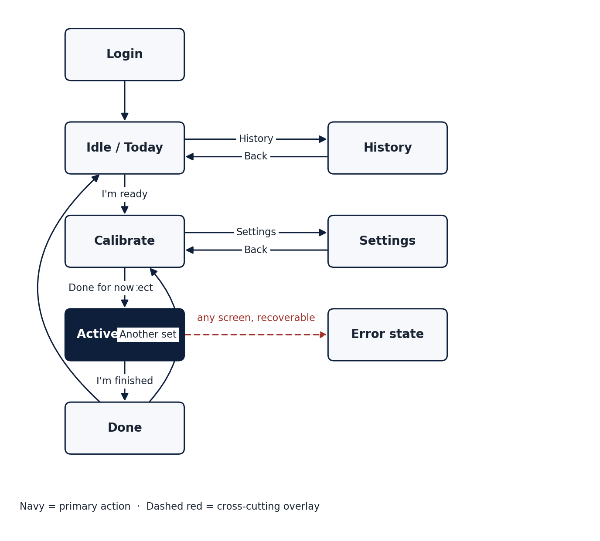
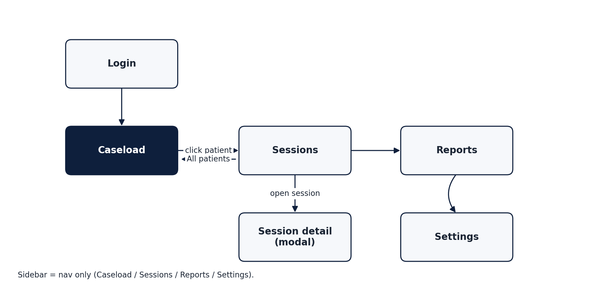

# D2.2 UI/UX Specifications and Mockups (Patient and Therapist)

## 1. Purpose and scope

This document specifies the user interfaces of the two ARISE software applications:

1. The **Coach app**, used by the patient during a sit-to-stand (STS) session. It provides live skeleton overlay, real-time corrective feedback, per-session summary, history, and per-device settings.
2. The **Therapist app**, used by clinicians to manage their caseload, review sessions, replay recordings, and track longitudinal progress.

The document is the engineering and design reference for Work Package 2 Task T2.3 and is the input to Work Package 4 prototype integration (T4.2 on-device coach software and T4.3 backend + dashboard). It does not specify the cloud back-end, which is covered by D2.1B, nor the AI pipeline, which is covered by D3 deliverables.

The specification is anchored to running React mockups in the repository at `apps/coach/` and `apps/therapist/`. Each screen described below corresponds to a concrete component in those mockups, which serve as the executable specification.

## 2. Definitions and acronyms

| Term | Definition |
|---|---|
| Coach app | Patient-facing application, runs on the acquisition node (Jetson Orin or laptop) in front of the participant during a session |
| Therapist app | Clinician-facing web application, runs in a desktop browser |
| Cycle | One full sit-to-stand-to-sit repetition |
| FTSS | Five-Times Sit-to-Stand test, total elapsed time over five reps |
| KPI | Key Performance Indicator, e.g. trunk lean angle, knee valgus, rep duration |
| Flag | An automatically detected execution error within a single rep |
| Adherence | Ratio of completed prescribed sessions over a defined window |
| Quality % | Per-session score in [0, 100] derived from rep cleanliness |
| LocalStorage | Browser-side persistent key-value store used in the mockup, replaced by the cloud API in WP4 |

## 3. Design principles

The two applications share an underlying philosophy but adopt deliberately different visual languages because they serve fundamentally different users in different physical contexts.

**Coach is a calm, focused, full-screen surface intended to be glanceable from 1.5 to 3 meters away** during physical effort. It uses a warm dark background, large typography, generous touch targets, a single primary action per screen, and motion that breathes rather than animates. The patient is mid-exercise, so the screen must not demand cognitive bandwidth that the body needs.

**Therapist is a dense information surface intended to be read at a desk** with mouse and keyboard. It uses a clean clinical light theme, navy and teal accent colors, compact tabular data, charts everywhere, and standard desktop patterns (sidebar nav, modals, contextual filters). The therapist is reviewing dozens of patients, so the screen must expose state efficiently.

Three principles apply to both:

1. **One way to do each thing.** No competing affordances. The user should never have to choose between two routes to the same destination.
2. **Persistent context is shown only when contextual.** State that does not apply to the current screen is removed. For example, the patient list is no longer in the Therapist sidebar because it only matters in the Caseload view.
3. **Local-first persistence in the mockup, API-backed in production.** Every piece of user state (settings, history, edited notes) is written to `localStorage` so the mockups are fully interactive and stateful without a back-end. In WP4 these calls are replaced with the cloud API defined in D2.1B, and the UI is unchanged.

## 4. The two applications at a glance

| | Coach | Therapist |
|---|---|---|
| Audience | Adult or older-adult participant (≥18 y) | Clinician |
| Hardware | Jetson Orin + RGB-D camera + optional pressure plate | Desktop or laptop browser |
| Layout | Single screen at a time, no nesting | Sidebar + main content, modals for details |
| Theme | Warm dark, mint accent | Light clinical, navy and teal accent |
| Primary input | Touch and physical proximity | Mouse and keyboard |
| State persistence (mockup) | localStorage keyed by patient ID | localStorage keyed by therapist session and per-patient |
| State persistence (WP4) | Cloud API + on-device cache | Cloud API, no local mirror needed |

## 5. Coach application

The Coach app is a single-page, single-screen flow. At any time exactly one of the following screens is active. The error-state surface is orthogonal to this flow. When any screen needs to surface a recoverable error (camera not available, pose model failed to load, network down, file missing), a shared `<ErrorState>` component takes over the main area with a clear title, body, retry, and dismiss.

### 5.1 Login

Centered single card with two fields (Patient ID and password) and a Continue button. In production the patient ID is the pseudonymized code generated automatically by the Innovina acquisition software at session creation, following the CERA-approved scheme (e.g. `sbj4112`). The participant does not type or memorise this code. The credential exchanged at this screen in production is a short-lived token issued by the Therapist app when the clinician queues the session, not a long-term password. The mockup accepts any input so the screen can be exercised end to end without a back-end.

### 5.2 Idle (Today)

Soft greeting ("Hello.") with a one-paragraph lede, a single primary call to action ("I'm ready"), and a small instructional tip below. The breathing background ring provides a focal point and signals the device is alive without demanding attention. The header carries a discrete navigation pill (Today, History, Settings) and the patient identifier. This pill disappears during Calibration and Active to keep the body of the participant the only thing on screen.

### 5.3 Calibration

Replaces the previous direct jump from Idle to Active. Two steps, both driven by the system rather than by the participant.

1. **Positioning.** Live camera preview is overlaid with a soft silhouette guide (head circle, torso rectangle) breathing at 0.25 Hz. Three numbered cues are listed in the side panel: sit upright with feet flat, cross arms gently, look ahead. The system itself detects when the participant is in frame and correctly aligned (head and shoulders inside the guide region, torso vertical within tolerance, both feet visible). No confirmation tap is required. While the system waits, the side panel shows a soft "Waiting for position" indicator.
2. **Calibrating.** Once the position check passes, a 5-second countdown ring fills counterclockwise while the pose model captures an antropometric baseline. The side panel reports "Loading pose model" then "Pose model ready". On completion the screen auto-advances to Active.

A "Not yet" button (not a link) is always present in the side panel to return to Idle without starting a session.

The calibration step exists for three reasons. First, to give the pose model a few seconds of warm-up before it has to produce real-time output. Second, to capture the participant's individual segment lengths so the z-score personalisation described in the ARISE methodology can begin from rep 1. Third, to reassure the participant that the system has seen them before exercise begins.

### 5.4 Active session

Full-bleed video on the left occupying most of the screen with skeleton overlay. HUD on the right with rep count, elapsed time, phase tracker (sitting, rising, standing, lowering), and a single "I'm finished" action.

Feedback is presented as transient, road-sign-style cards centered over the body for about 4 seconds when a flag is raised, with an animated corrective arrow attached to the relevant joint. A clean rep triggers a small mint check overlay. No metric or technical detail (joint angle, deviation %, z-score) is shown on this screen. The surface is intentionally non-clinical to keep the participant in the body, not in the data.

### 5.5 Done (post-session summary)

Personal greeting ("Beautiful work.") and four tiles: reps, clean reps, form score %, average per rep. Below, a "Things to work on next time" section lists the unique faults observed in the session with count, short tip, and icon. Two actions, "Another set" (returns to Calibration to start a fresh session) and "Done for now" (returns to Idle).

On entering this screen the session is persisted to the patient's local history under `arise.coach.history.<patientId>`. The persisted record includes timestamp, rep counts, score, duration, and the set of unique faults encountered.

### 5.6 History

Day-grouped chronological view of the participant's completed sessions on this device. The top summary tiles report days active, total sessions, total clean reps, and average score. Below, sessions are grouped by day with a friendly relative label (Today, Yesterday, weekday, "N days ago") plus the full date, and per-day totals.

Within each day, sessions are listed most-recent first and explicitly labelled "Session N of M" to make multi-session days legible. A session row is collapsible and expands to show its fault breakdown. A "Clear history" action in the header removes the entire local history after confirmation.

The day grouping is important because rehabilitation protocols often involve multiple short sessions per day rather than one long one, and the previous flat list buried that pattern.

### 5.7 Settings

Three grouped cards.

1. **Profile.** Patient ID (read-only, derived from login), optional display name.
2. **Coach experience.** Spoken-cues toggle (with explanatory hint), high-contrast toggle, text size selector (Regular, Large, Extra large).
3. **Capture.** Camera selector (System default, Front, Rear) and motion-sensitivity selector (Gentle, Standard, Strict). These are placeholders for the production capture configuration. In the mockup they persist via `arise.coach.settings` but do not yet alter capture behaviour.

Settings auto-save on every change and display a discrete "Saved ✓" indicator.

### 5.8 Error state (cross-cutting)

A reusable `<ErrorState>` component is mounted by the Coach shell whenever an error is set. It overrides any active screen with a centered card containing a tone-appropriate icon (camera, network, pose, generic), a title, a one-paragraph body, and up to two actions (Retry, Dismiss). The four icon variants share a single visual treatment and use the Coach accent palette so the error state never feels foreign.

## 6. Therapist application

The Therapist app uses a persistent left sidebar for navigation and a top breadcrumb bar inside the main area. The sidebar contains only navigation (Caseload, Sessions, Reports, Settings) and the signed-in clinician chip. The patient list is no longer in the sidebar. It lives in the Caseload view where it belongs.

### 6.1 Login

Centered single-card layout with clinician ID or email and password. Initials are derived from the entered identifier and used throughout the dashboard for author attribution on notes and modals.

### 6.2 Caseload

The default landing view. Four sections, top to bottom.

1. **Overview row.** Four KPI cards: total patients, sessions in the last 7 days, average improvement %, total open flags.
2. **Patients to watch.** Up to five patients ranked by a composite attention score (worsening trend, low adherence, open flags), each row clickable.
3. **Caseload snapshot.** Four small tiles: active today, on schedule (adherence ≥ 80%), improving, worsening.
4. **All patients.** A compact grid of patient cards. Each card shows only the participant's initials avatar, name, ID, and trend arrow, plus a chevron. Cards are sortable (needs attention, name, sessions, adherence) and searchable (name, ID, diagnosis). Clicking a card navigates to the Sessions view filtered to that patient.

The cards are intentionally minimal. The detailed KPIs previously shown on the patient cards (sessions count, last FTSS, adherence %, open flags) are not absent. They are deferred to the Sessions view of that patient, where the therapist can see them in the context of session history and charts.

### 6.3 Sessions

Two modes determined by the patient filter.

**All patients.** A day-grouped list of every recent session across the caseload. Each day card shows totals (sessions, reps, flags, quality %) and expands to a per-session table with date, patient, session ID, reps, FTSS, flags, notes, and an "Open" action.

**Single patient.** When the user navigates here from a patient card in Caseload, the patient filter is preset. A "← All patients" action sits above the patient header. The view contains, in order:

1. Patient header with name, ID, age, diagnosis, and four KPIs (sessions, last FTSS, adherence, open flags).
2. "Quality per day" chart, 14-day daily quality % with target line at 80%.
3. Two side-by-side charts, the error mix donut and the stacked error timeline (one mini area chart per error type).
4. The same day-grouped session list as the all-patients mode, but scoped.
5. **Therapist notes** for this patient, a persistent feed with compose box, Ctrl+Enter to save, per-note author and timestamp.

This consolidation of the per-patient detail into Sessions removes the previous duplication where Caseload also acted as a patient-detail page.

### 6.4 Session detail (modal)

Opened from any session row. The modal carries four sections.

1. **Header.** Date, patient, reps, FTSS, total flags pill.
2. **Replay player.** 16:9 video pane sourcing `/sessions/{sessionId}.mp4`. Below the video, a custom scrub bar with rep tick marks and colored flag dots positioned at the timestamp of each flag. Below the scrub bar, a rep-chip strip with one button per rep showing rep number and duration, with colored dots for each flag in that rep. Clicking a chip seeks the video to the rep start. The active rep highlights as the playhead enters it. If the video file is absent (common in the mockup), the pane falls back to a clean "Recording not available in demo" panel that explains where to drop a real file. In production the video is the de-identified (face-blurred) recording defined in the CERA submission.
3. **Flag breakdown.** Per-error-type counts with colored bullets. Collapses to a "Clean session" message when no flags were raised.
4. **Editable notes.** A textarea pre-filled from the session's notes. Saves on blur or Ctrl+Enter to `arise.therapist.session-notes.<sessionId>` in localStorage. Status indicator shows Unsaved or Saved ✓. A Revert action restores the original note when the edit differs from it.

The replay scrub bar is the central interaction. It lets the therapist scrub directly to the moment of any flag without scrubbing through the whole video. The same coloring used in the donut and the timeline is reused for the scrub flag dots so the visual language is consistent across the dashboard.

### 6.5 Reports

Two modes via segmented control.

**Caseload.** Aggregate KPIs over the whole caseload (total sessions, mean quality, mean adherence, total flags), daily quality chart, adherence bar chart per patient, patients × error types heatmap (per-column intensity scaling so each column has its own range), and a stacked-bar caseload error mix.

**Per patient.** Patient header plus the same four-KPI overview, daily quality chart, error mix donut, and stacked error timeline that appear in the Sessions per-patient view, scoped to one patient.

### 6.6 Settings

Two cards. Profile (read-only initials and role) and Preferences (unit system, email alerts on red flags, weekly digest). Save triggers a toast.

## 7. Interaction patterns

### 7.1 Authentication and session bootstrap

Both apps persist a minimal user object in localStorage under `arise.coach.session` and `arise.therapist.session`. On startup the app reads this and skips the Login screen if present. Sign-out clears the key. In production this becomes a refresh-token flow against the cloud identity provider defined in D2.1B Section 3.1, with no change to the UI.

### 7.2 Patient-to-session navigation

The canonical path to any patient's data is Caseload → patient card → Sessions view filtered to that patient. There is no other path. The previous Caseload view exposed per-patient detail inline, which created two visually different "patient pages" (Caseload's bottom half and a hypothetical detail page). The consolidation eliminates that ambiguity.

### 7.3 Notes architecture

There are two distinct note surfaces, intentionally separate:

- **Patient notes** (in Sessions view when filtered to one patient): a persistent feed of observations the therapist wants associated with the patient over time. Stored under `arise.therapist.notes.<patientId>`.
- **Session notes** (in Session detail modal): a short text field associated with a single session, editable by the therapist after the fact. Stored under `arise.therapist.session-notes.<sessionId>`.

Both use save-on-blur with Ctrl+Enter to commit explicitly. Both signal Saved / Unsaved status. The session note shows a Revert link when the edited text differs from the fixture original.

### 7.4 Multi-session days

Both apps now make multiple-sessions-per-day a first-class concept. In the Coach, the History view groups by day and labels sessions "N of M". In the Therapist, the Sessions day cards show the count and reveal individual sessions on expand, and the fixture dataset includes several days with 2 or 3 sessions for the same patient so the pattern is exercised.

### 7.5 Empty states and errors

Every list, chart, and feed renders an empty-state message rather than a blank area when it has no data. The Coach uses the shared `<ErrorState>` for recoverable errors. The Therapist uses inline empty messages for list filters and toasts for transient operations (settings saved, session queued).

## 8. Visual design system

### 8.1 Color

**Coach palette** (warm dark, non-clinical):

| Role | Token | Value |
|---|---|---|
| Background 1 | `--coach-bg-1` | `#1b1f2b` |
| Background 2 | `--coach-bg-2` | `#29202e` |
| Ink primary | `--coach-ink` | `#F3EBE0` |
| Mint accent | `--coach-mint` | `#9BE5C8` |
| Coral accent | `--coach-coral` | `#FFB6A6` |
| Amber accent | `--coach-amber` | `#F2C879` |
| Rose alert | `--coach-rose` | `#FF7A88` |

**Therapist palette** (clean clinical):

| Role | Token | Value |
|---|---|---|
| Background | `--bg` | light slate |
| White surface | `--white` | `#FFFFFF` |
| Navy primary | `--navy` | deep navy |
| Teal accent | `--teal` | teal mid |
| Teal pale | `--teal-pale` | teal wash |
| OK | `--ok` | clinical green |
| Bad | `--bad` | clinical red |

The two palettes are independent. The only shared concept is the per-error color vocabulary used in donut, timeline, scrub bar, and rep chips, so a flag of a given type always carries the same hue across surfaces.

### 8.2 Typography

Both apps use Calibri-equivalent system sans-serif. Coach uses thinner, larger display weights (font-weight 300 at 32-48 px for titles) to keep the warm, calm tone. Therapist uses heavier display weights (font-weight 600-700) at 14-18 px to maximize information density.

### 8.3 Layout primitives

- Card radius: 22 px (Coach), 12-14 px (Therapist).
- Card padding: 22-28 px (Coach), 14-20 px (Therapist).
- Section spacing: 20-24 px between cards.

### 8.4 Iconography

Coach uses hand-drawn line SVGs for fault types, drawn at 64×64, two-color (stroke + glow). Therapist uses small filled SVG marks and tabular symbols (▲ ▼ ■) for trend arrows.

## 9. Accessibility

The mockups implement baseline patterns. A full WCAG 2.1 AA audit is scheduled for WP4 prototype acceptance.

- All interactive elements are real `<button>` or form elements with visible focus rings (inherited from browser defaults).
- Color is never the sole conveyor of state: trend arrows accompany trend colors, fault badges combine color with icon and text.
- The Coach text-size selector and high-contrast toggle are present in Settings. The underlying styles are scaffolded but not yet fully wired (open item in WP4).
- Touch targets in Coach are ≥ 44×44 px.
- The Therapist app supports keyboard navigation through tab order and Ctrl+Enter to commit notes.
- ARIA roles and labels are present on toggles and modal close buttons. A comprehensive ARIA audit is part of the WP4 acceptance criteria.

## 10. Tech stack and dependencies

| Concern | Choice | Rationale |
|---|---|---|
| Framework | React 18 with Vite | Fast HMR, small bundle, no SSR overhead since both apps are SPAs |
| Styling | Hand-written CSS with CSS variables | No framework dependency, tokens are explicit and easy to inspect |
| Pose estimation (Coach) | `@mediapipe/tasks-vision` Pose Landmarker Lite | Browser-runnable, GPU-accelerated, MIT-friendly license |
| State management | Local component state + localStorage | The mockups have no global state need, in WP4 a small store (Zustand or React Query) wraps the cloud API |
| Charts | Hand-written SVG | No charting library, avoids 100+ kB of unused functionality and keeps the visual language exact |
| Build target | Static SPA | The Therapist app is served from S3 + CloudFront per D2.1B. The Coach app is packaged as a desktop or kiosk PWA for the acquisition node |

## 11. From mockup to WP4 production

The mockups in `apps/coach/` and `apps/therapist/` are the visual and interaction specification for WP4 implementation. Two transitions are required to lift them into the production system:

1. **Replace localStorage with the cloud API.** Every read or write currently using `localStorage` becomes an API call against the endpoints defined in D2.1B Section 4 (ingestion, sessions, notes, settings, history). The component code is unchanged, only the persistence helpers are swapped.
2. **Replace the demo video selector and fixture data.** The Coach currently allows selecting a demo video file as its "camera input". This is replaced by the live RGB-D camera stream on the Jetson Orin. The Therapist currently reads fixtures from `data.js`. This is replaced by the cloud API.

The skeleton overlay, pose pipeline, fault detection, feedback timing, scrub bar interaction, day-grouped lists, modal behaviors, and authentication shell are all reused as-is.

## 12. Open items and decisions deferred

| Item | Owner | Resolution by |
|---|---|---|
| Final design tokens for high-contrast mode and large text size | Innovina | WP4 T4.2 kick-off |
| Live wiring of camera selector to the acquisition node SDK | Innovina | WP4 T4.2 |
| Localization strategy (Italian, English, others) | UNIGE + Innovina | Before WP5 patient enrolment |
| Final authentication scheme for the Coach (short-lived token vs password) | Innovina | WP4 T4.2 |
| ARIA audit and WCAG 2.1 AA conformance | Innovina | WP4 acceptance |
| Pressure plate UI surface (placement of synchronization status and per-rep GRF curves) | Innovina + UNIGE | After plate model is selected |
| Cloud-edge split for face blurring (on-device on Orin, or in the ingest pipeline) | Innovina | Resolved together with D2.1B/bis |

## 13. Mockup artifacts

The executable mockups are at:

- `apps/coach/src/App.jsx` and `apps/coach/src/App.css` — Coach app.
- `apps/therapist/src/App.jsx`, `apps/therapist/src/data.js` and `apps/therapist/src/App.css` — Therapist app.

To run either app: `cd apps/<app> && npm install && npm run dev`. Both apps are fully interactive in the browser without a back-end.

Screenshots of each screen referenced in Sections 5 and 6 are stored in `docs/d2.2_mockups/` and are to be embedded in the docx companion to this document.

## 14. References

- D2.1A Market Analysis (ARISE WP2).
- D2.1B Cloud Architecture (ARISE WP2).
- D1.1 Clinical Requirements and Biomechanical KPIs (ARISE WP1).
- ARISE CERA Richiesta Parere submission (UNIGE 2026).
- MediaPipe Pose Landmarker documentation, Google, 2024.
- WCAG 2.1, W3C Recommendation, 2018.
